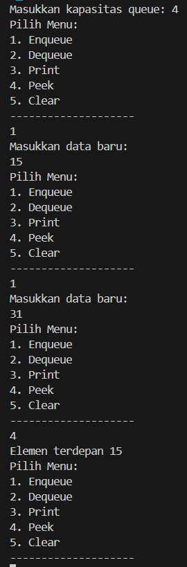
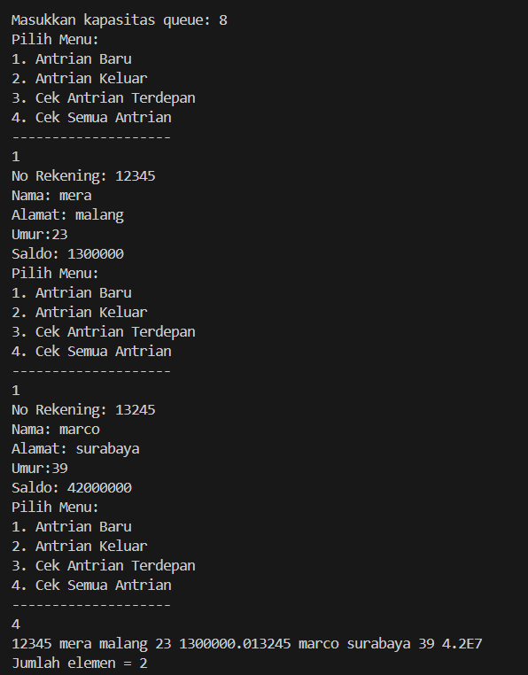
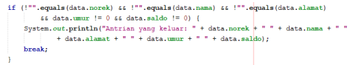
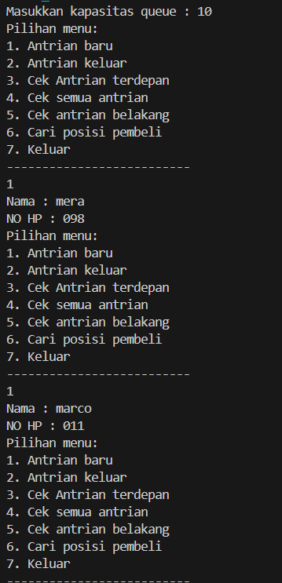
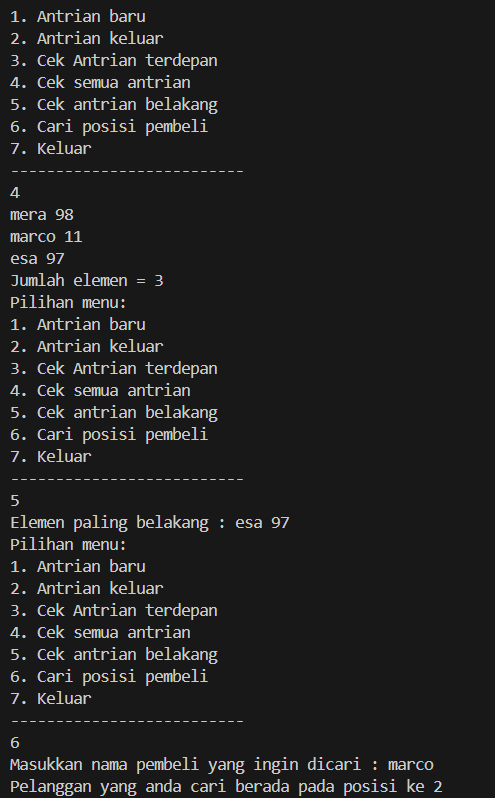

# 
  LAPORAN PRAKTIKUM ALGORITMA DAN STRUKTUR DATA 
 
# 
  JOBSHEET 10 
 
# 
  QUEUE 
 
    

    

     

 Nama : Tiara Mera Sifa 

 NIM  : 2341720247 

 Prodi: D-IV Teknik Informatika

 Kelas: 1B / 27 

     

# Praktikum

## 10.2 Praktikum 1
### class queue27

         public class queue27 {
            int[] data;
            int front;
            int rear;
            int size;
            int max;

            public queue27(int n) {
               max = n;
               data = new int[max];
               size = 0;
               front = rear = -1;
            }

            public boolean IsEmpty() {
               if (size == 0) {
                     return true;
               } else {
                     return false;
               }
            }

            public boolean IsFull() {
               if (size == max) {
                     return true;
               } else {
                     return false;
               }
            }

            public void peek() {
               if (!IsEmpty()) {
                     System.out.println("Elemen terdepan "+ data[front]);
               } else {
                     System.out.println("Queue masih kosong");
               }
            }

            public void print() {
               if (IsEmpty()) {
                     System.out.println("Queue masih kosong");
               } else {
                     int i = front;
                     while (i != rear) {
                        System.out.print("Queue masih kosong");
                        i = (i + 1) % max;
                     }
                     System.out.println(data[i] + "");
                     System.out.println("Jumlah elemen = " + size);
               }
            }

            public void clear() {
               if (IsEmpty()) {
                     front = rear = -1;
                     size = 0;
                     System.out.println("Queue berhasil dikosongkan");
               } else {
                     System.out.println("Queue masih kosong");
               }
            }
            public void Enqueue(int dt) {
               if (IsFull()) {
                     System.out.println("Queue sudah penuh");
               } else {
                     if (IsEmpty()) {
                        front = rear = 0;
                     } else {
                        if (rear == max -1) {
                           rear = 0;
                        } else {
                           rear++;
                        }
                     }
                     data[rear] = dt;
                     size++;
               }
            }

            public int Dequeue() {
               int dt = 0;
               if (IsEmpty()) {
                     System.out.println("Queue masih kosong");
               } else {
                     dt = data[front];
                     size--;
                     if (IsEmpty()) {
                        front = rear = -1;
                     } else {
                        if (front == max -1) {
                           front = 0;
                        } else {
                           front++;
                        }
                     }
               }
               return dt;
            }
         }

### class QueueMain27

         import java.util.Scanner;

         public class QueueMain27 {
            public static void menu() {
               System.out.println("Pilih Menu:");
               System.out.println("1. Enqueue");
               System.out.println("2. Dequeue");
               System.out.println("3. Print");
               System.out.println("4. Peek");
               System.out.println("5. Clear");
               System.out.println("--------------------");
            }
            public static void main(String[] args) {
               Scanner sc27 = new Scanner(System.in);

               System.out.print("Masukkan kapasitas queue: ");
               int n = sc27.nextInt();

               queue27 q = new queue27(n);

               int pilih;
               do {
                     menu();
                     pilih = sc27.nextInt();
                     switch(pilih) {
                        case 1:
                           System.out.println("Masukkan data baru: ");
                           int dataMasuk = sc27.nextInt();
                           q.Enqueue(dataMasuk);
                           break;
                        
                        case 2:
                        int dataKeluar = q.Dequeue();
                        if (dataKeluar != 0) {
                           System.out.println("Data yang dikeluarkan: " + dataKeluar);
                        }
                           
                        
                        case 3:
                           q.print();
                           break;

                        case 4:
                           q.peek();
                           break; 

                        case 5: 
                           q.clear();
                        
                        default :
                           break;
                        
                     }
               } while (pilih == 1 || pilih == 2 || pilih == 3 || pilih == 4 || pilih == 5);
            }
         }

## 10.2.2 Verifikasi Hasil Percobaan

## 10.2.3 Pertanyaan
1. Pada konstruktor, mengapa nilai awal atribut front dan rear bernilai -1, sementara atribut size bernilai 0?  
   untuk memberi tahu bahwa antrian masih kosong dan size nya 0 karena belum ada elemen yang diinputkan.
2. Pada method Enqueue, jelaskan maksud dan kegunaan dari potongan kode berikut! 
   kode tersebut berfungsi jika rear sudah mencapai max -1 artinya array sudaj penuh dan rear akan diatur ulang ke 0 untuk mulai dari awal.
3. Pada method Dequeue, jelaskan maksud dan kegunaan dari potongan kode berikut! 
   kode tersebut berfungsi untuk mengatur ulang front saat elemen pertama diambil, jika fornt == max -1 artinya telah sampai pada akhir array maka front akan diatur ulang ke 0.
4. Pada method print, mengapa pada proses perulangan variabel i tidak dimulai dari 0 (int i=0), melainkan int i=front?  
   karena akan mencetak berurutan mulai dari elemen yang pertama
5. Perhatikan kembali method print, jelaskan maksud dari potongan kode berikut! 
   kode tersebut mengatur nilai i agar indeks i kembali ke 0 sesudah mencapai max -1.
6. Tunjukkan potongan kode program yang merupakan queue overflow! 

            public boolean IsFull() {
               if (size == max) {
                     return true;
               } else {
                     return false;
               }
            }

7. Pada saat terjadi queue overflow dan queue underflow, program tersebut tetap dapat berjalan dan hanya menampilkan teks informasi. Lakukan
modifikasi program sehingga pada saat terjadi queue overflow dan queue underflow, program dihentikan! 

         public void Enqueue(int dt) {
               if (IsFull()) {
                     System.out.println("Queue sudah penuh");

         public int Dequeue() {
               int dt = 0;
               if (IsEmpty()) {
                     System.out.println("Queue masih kosong");

## 10.3 Praktikum 2
### class nasabah27

         public class nasabah27 {
            String norek, nama, alamat;
            int umur;
            double saldo;

            nasabah27(String norek, String nama, String alamat, int umur, double saldo) {
               this.norek = norek;
               this.nama = nama;
               this.alamat = alamat;
               this.umur = umur;
               this.saldo = saldo;
            }
            
            nasabah27() {

            }
         }

### class Queue227

         public class Queue227 {
            nasabah27[] data;
            int front;
            int rear;
            int size;
            int max;

            public Queue227(int n) {
               max = n;
               data = new nasabah27[max];
               size = 0;
               front = rear = -1;
            }

            public boolean IsEmpty() {
               if (size == 0) {
                     return true;
               } else {
                     return false;
               }
            }

            public boolean IsFull() {
               if (size == max) {
                     return true;
               } else {
                     return false;
               }
            }

            public void peek() {
               if (!IsEmpty()) {
                     System.out.println("Elemen terdepan: " + data[front].norek + " " + data[front].nama 
                     + " " + data[front].alamat + " " + data[front].umur + " " + data[front].saldo);
               } else {
                     System.out.println("Queue masih kosong");
               }
            }

            public void print() {
               if (IsEmpty()) {
                     System.out.println("Queue masih kosong");
               } else {
                     int i = front;
                     while (i != rear) {
                        System.out.print(data[i].norek + " " + data[i].nama
                                 + " " + data[i].alamat + " " + data[i].umur + " " + data[i].saldo);
                        i = (i + 1) % max;
                     }
                     System.out.println(data[i].norek + " " + data[i].nama
                        + " " + data[i].alamat + " " + data[i].umur + " " + data[i].saldo);
                     System.out.println("Jumlah elemen = " + size);
               }
            }

            public void clear() {
               if (IsEmpty()) {
                     front = rear = -1;
                     size = 0;
                     System.out.println("Queue berhasil dikosongkan");
               } else {
                     System.out.println("Queue masih kosong");
               }
            }

            public void Enqueue(nasabah27 dt) {
               if (IsFull()) {
                     System.out.println("Queue sudah penuh");
               } else {
                     if (IsEmpty()) {
                        front = rear = 0;
                     } else {
                        if (rear == max -1) {
                           rear = 0;
                        } else {
                           rear++;
                        }
                     }
                     data[rear] = dt;
                     size++;
               }
            }
            public nasabah27 Dequeue() {
               if (IsEmpty()) {
                     System.out.println("Queue masih kosong");
                     return null; 
               } else {
                     nasabah27 dt = data[front];
                     size--;
                     if (front == rear) {
                        front = rear = -1;
                     } else {
                        front = (front + 1) % max;
                     }
                     return dt;
               }
            }

            public void peekRear() {
               if (!IsEmpty()) {
                     System.out.println("Elemen paling belakang: " + data[rear].norek + " " + data[rear].nama
                        + " " + data[rear].alamat + " " + data[rear].umur + " " + data[rear].saldo);
               } else {
                     System.out.println("Queue Masih Kosong");
               }
            }

            
         }

### class QueueMain227

         import java.util.Scanner;

         public class QueueMain227 {
            public static void menu() {
               System.out.println("Pilih Menu:");
               System.out.println("1. Antrian Baru");
               System.out.println("2. Antrian Keluar");
               System.out.println("3. Cek Antrian Terdepan");
               System.out.println("4. Cek Semua Antrian");
               System.out.println("--------------------");
            }
            public static void main(String[] args) {
               Scanner sc27 = new Scanner(System.in);

               System.out.print("Masukkan kapasitas queue: ");
               int jumlah = sc27.nextInt();

               Queue227 antri = new Queue227(jumlah);

               int pilih;
               do {
                     menu();
                     pilih = sc27.nextInt();
                     switch(pilih) {
                        case 1:
                           System.out.println("No Rekening: ");
                           String norek = sc27.next();
                           System.out.println("Nama: ");
                           String nama = sc27.next();
                           System.out.println("Alamat: ");
                           String alamat = sc27.next();
                           System.out.println("Umur:");
                           int umur = sc27.nextInt();
                           System.out.println("Saldo: ");
                           double saldo = sc27.nextDouble();
                           nasabah27 nb = new nasabah27(norek, nama, alamat, umur, saldo);
                           sc27.nextLine();
                           antri.Enqueue(nb);
                           break;
                        
                           case 2:
                           nasabah27 data = antri.Dequeue();
                           if (data != null) {
                                 System.out.println("Antrian yang keluar: " + data.norek + " " + data.nama + " " 
                                    + data.alamat + " " + data.umur + " " + data.saldo);
                           } else {
                                 System.out.println("Antrian kosong, tidak ada data yang dikeluarkan.");
                           }
                           break;
                        
                        case 3:
                           antri.peek();
                           break;

                        case 4:
                           antri.print();
                           break; 
                        
                        default :
                           break;
                        
                     }
               } while (pilih == 1 || pilih == 2 || pilih == 3 || pilih == 4);
            }
         }

## 10.3.2 Verifikasi Hasil Percobaan

## 10.3.3 Pertanyaan
1. Pada class QueueMain, jelaskan fungsi IF pada potongan kode program berikut!   
  
untuk memastikan bahwasanyya data yang keluar dari queue setelah operasi deequeue adalah data yang valid dan tidak kosong. Dan apabila data tersebut valid maka data akan diprint.
2. Lakukan modifikasi program dengan menambahkan method baru bernama peekRear pada class Queue yang digunakan untuk mengecek antrian yang berada di posisi belakang! Tambahkan pula daftar menu 5. Cek Antrian paling belakang pada class QueueMain sehingga method peekRear dapat dipanggil!  

         case 5: 
                           antri.peekRear();

                        default :
                           break;

         void PeekRear() {
               if (!isEmpty()) {
                     System.out.println("Elemen paling belakang : " + antrian[rear].nama + " "
                           + antrian[rear].noHP);
               } else {
                     System.out.println("Antrian masih kosong");
               }
            }

## Tugas
### class pembeli27

         public class pembeli27 {
            String nama;
            int noHP;

            public pembeli27(String nama,int noHP){
               this.nama = nama;
               this.noHP = noHP;
            }
         }

### class QueuePembeli27

         public class QueuePembeli27 {
            pembeli27[] antrian;
            int front;
            int rear;  
            int size; 
            int max;

            QueuePembeli27(int n) {
               max = n;
               antrian = new pembeli27[max];
               size = 0;
               front = rear = -1;
            }

            public boolean isEmpty() {
               return size == 0;
            }

            public boolean isFull() {
               return size == max;
            }

            void Enqueue(pembeli27 antri) {
               if (isFull()) {
                     System.out.println("Antrian sudah penuh");
                     return;
               } else {
                     if (isEmpty()) {
                        front = rear = 0;
                     } else {
                        rear = (rear + 1) % max;
                     }
                     antrian[rear] = antri;
                     size++;
               }
            }

            public pembeli27 Dequeue() {
                  pembeli27 antri = null;
               if (isEmpty()) {
                     System.out.println("Antrian masih kosong");
               } else {
                     antri = antrian[front];
                     size--;
                     if (isEmpty()) {
                        front = rear = -1;
                     } else {
                        front = (front + 1) % max;
                     }
               }
               return antri;
            }

            void Peek() {
               if (!isEmpty()) {
                     System.out.println("Elemen terdepan : " + antrian[front].nama + " "
                           + antrian[front].noHP);
               } else {
                     System.out.println("Antrian masih kosong");
               }
            }

            void PeekRear() {
               if (!isEmpty()) {
                     System.out.println("Elemen paling belakang : " + antrian[rear].nama + " "
                           + antrian[rear].noHP);
               } else {
                     System.out.println("Antrian masih kosong");
               }
            }

            void DaftarPembeli() {
               if (isEmpty()) {
                     System.out.println("Antrian masih kosong");
               } else {
                     int i = front;
                     while (i != rear) {
                        System.out.println(antrian[i].nama + " "
                                 + antrian[i].noHP);
                        i = (i + 1) % max;
                     }
                     System.out.println(antrian[i].nama + " "
                           + antrian[i].noHP);
                     System.out.println("Jumlah elemen = " + size);
               }
            }

            void PeekPosition(String nama) {
               int pos = -1;
               int i = front;
               while (i != rear) {
                     if (antrian[i].nama.equals(nama)) {
                        pos = i;
                     }
                     i = (i + 1) % max;
               }
               if (pos > 0) {
                     System.out.println("Pelanggan yang anda cari berada pada posisi ke " + (pos + 1));
               } else {
                     System.out.println("Pelanggan yang anda cari tidak ada");
               }
            }

            public void menu(){
               System.out.println("Pilihan menu: ");
               System.out.println("1. Antrian baru");
               System.out.println("2. Antrian keluar");
               System.out.println("3. Cek Antrian terdepan");
               System.out.println("4.Cek semua  antrian");
               System.out.println("5. Cek antrian belakang");
               System.out.println("6. Cari posisi pembeli");
               System.out.println("7. Keluar");
               System.out.println("--------------------------");

            }

         }

### class PembeliMain

         import java.util.Scanner;

         public class PembeliMain {
            public static void main(String[] args) {
               Scanner sc27 = new Scanner(System.in);
               Scanner sc277 = new Scanner(System.in);
               System.out.print("Masukkan kapasitas queue : ");
               int jumlah = sc27.nextInt();

               QueuePembeli27 Q = new QueuePembeli27(jumlah);

               int pilih = 0;

               do {
                     Q.menu();
                     pilih = sc27.nextInt();
                     switch (pilih) {
                        case 1:
                           System.out.print("Nama : ");
                           String nama = sc277.nextLine();
                           System.out.print("No HP : ");
                           int noHP = sc27.nextInt();
                           pembeli27 nb = new pembeli27(nama, noHP);
                           Q.Enqueue(nb);
                           break;
                        case 2:
                           pembeli27 data = Q.Dequeue();
                           if (!"".equals(data.nama) && data.noHP != 0) {
                                 System.out.println("Data yang dikeluarkan : " + data.nama + " " + data.noHP);
                           }
                           break;
                        case 3:
                           Q.Peek();
                           break;
                        case 4:
                           Q.DaftarPembeli();
                           break;
                        case 5:
                           Q.PeekRear();
                           break;
                        case 6:
                           System.out.print("Masukkan nama pembeli yang ingin dicari : ");
                           String cariNama = sc277.nextLine();
                           Q.PeekPosition(cariNama);
                           break;
                     }
               } while (pilih == 1 || pilih == 2 || pilih == 3 || pilih == 4 || pilih == 5 || pilih == 6);
            }
         }

## verifikasi hasil percobaan

