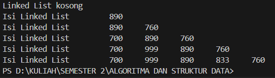
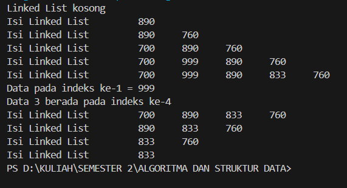
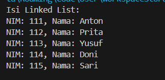
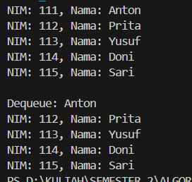

# 
  LAPORAN PRAKTIKUM ALGORITMA DAN STRUKTUR DATA 
 
# 
  JOBSHEET 11 
 
# 
  LINKED LIST 
 
    

    

     

 Nama : Tiara Mera Sifa 

 NIM  : 2341720247 

 Prodi: D-IV Teknik Informatika

 Kelas: 1B / 27 

     

# Praktikum
## 2.1 Pembuatan Single Linked List

### class Node27.java

            public class Node27 {
                int data;
                Node27 next;

                Node27 (int nilai, Node27 berikutnya){
                    data = nilai;
                    next = berikutnya;
                }
            }

### class SingleLinkedList27.java

            public class SingleLinkedList27 {
                Node27 head, tail;

                boolean isEmpty() {
                    return head == null;
                }

                void print() {
                    if (isEmpty()) {
                        System.out.println("Linked List kosong");
                    } else {
                        Node27 tmp = head;
                        System.out.print("Isi Linked List \t");
                        while (tmp != null) {
                            System.out.print(tmp.data + "\t");
                            tmp = tmp.next;
                        }
                        System.out.println("");
                    }
                }

                void addFirst(int input) {
                    Node27 ndInput = new Node27(input, null);
                    if (isEmpty()) {
                        head = ndInput;
                        tail = ndInput;
                    } else {
                        ndInput.next = head;
                        head = ndInput;
                    }
                }

                void addLast(int input) {
                    Node27 ndInput = new Node27(input, null);
                    if (isEmpty()) {
                        head = ndInput;
                        tail = ndInput;
                    } else {
                        tail.next = ndInput;
                        tail = ndInput;
                    }
                }

                void insertAfter(int key, int input) {
                    Node27 ndInput = new Node27(input, null);
                    Node27 temp = head;
                    while (temp != null) {
                        if (temp.data == key) {
                            ndInput.next = temp.next;
                            temp.next = ndInput;
                            if (ndInput.next == null) {
                                tail = ndInput;
                            }
                            break;
                        }
                        temp = temp.next;
                    }
                }

                void insertAt(int index, int input) {
                    Node27 ndInput = new Node27(input, null);
                    if (index < 0) {
                        System.out.println("Perbaiki logikanya! Kalau indeksnya -1 bagaimana??");
                    } else if (index == 0) {
                        addFirst(input);
                    } else {
                        Node27 temp = head;
                        for (int i = 0; i < index - 1 && temp != null; i++) {
                            temp = temp.next;
                        }
                        if (temp != null) {
                            ndInput.next = temp.next;
                            temp.next = ndInput;
                            if (ndInput.next == null) {
                                tail = ndInput;
                            }
                        } else {
                            System.out.println("Indeks melebihi panjang linked list");
                        }
                    }
                }
            }

### class SLLMain.java

            public class SLLMain {
                public static void main(String[] args) {
                    SingleLinkedList27 singLL = new SingleLinkedList27();
                    singLL.print();
                    singLL.addFirst(890);
                    singLL.print();;
                    singLL.addLast(760);
                    singLL.print();
                    singLL.addFirst(700);
                    singLL.print();;
                    singLL.insertAfter(700, 999);
                    singLL.print();
                    singLL.insertAt(3, 833);
                    singLL.print();
                }
            }

## 2.1.1 Verifikasi Hasil Percobaan

## 2.1.2 Pertanyaan
1. Mengapa hasil compile kode program di baris pertama menghasilkan “Linked List Kosong”?
 Hasil ini terjadi karena saat program pertama kali dijalankan, linked list masih dalam keadaan kosong. 
Oleh karena itu, kondisi isempty dalam metode print akan bernilai true dan akan mencetak "Linked List Kosong".

2. Jelaskan kegunaan variable temp secara umum pada setiap method!
Variabel temp digunakan untuk melakukan berbagai operasi seperti penambahan, penghapusan, atau pencarian node dalam linked list.

3. Perhatikan class SingleLinkedList, pada method insertAt Jelaskan kegunaan kode berikut 
 Kode ini digunakan untuk memastikan bahwa node baru yang ditambahkan di akhir linked list diatur dengan benar. Ini memeriksa apakah node yang ditunjuk adalah node terakhir. Jika benar, maka tail akan diatur untuk menunjuk ke node baru tersebut, memastikan bahwa tail selalu menunjuk ke node terakhir dalam linked list.
## 2.2 Modifikasi Elemen pada Single Linked List

### SingleLinkedList.java
public class SingleLinkedList27 {
    Node27 head, tail;

    boolean isEmpty() {
        return head == null;
    }

    void print() {
        if (isEmpty()) {
            System.out.println("Linked List kosong");
        } else {
            Node27 tmp = head;
            System.out.print("Isi Linked List \t");
            while (tmp != null) {
                System.out.print(tmp.data + "\t");
                tmp = tmp.next;
            }
            System.out.println("");
        }
    }

    void addFirst(int input) {
        Node27 ndInput = new Node27(input, null);
        if (isEmpty()) {
            head = ndInput;
            tail = ndInput;
        } else {
            ndInput.next = head;
            head = ndInput;
        }
    }

    void addLast(int input) {
        Node27 ndInput = new Node27(input, null);
        if (isEmpty()) {
            head = ndInput;
            tail = ndInput;
        } else {
            tail.next = ndInput;
            tail = ndInput;
        }
    }

    void insertAfter(int key, int input) {
        Node27 ndInput = new Node27(input, null);
        Node27 temp = head;
        while (temp != null) {
            if (temp.data == key) {
                ndInput.next = temp.next;
                temp.next = ndInput;
                if (ndInput.next == null) {
                    tail = ndInput;
                }
                break;
            }
            temp = temp.next;
        }
    }

    void insertAt(int index, int input) {
        Node27 ndInput = new Node27(input, null);
        if (index < 0) {
            System.out.println("Perbaiki logikanya! Kalau indeksnya -1 bagaimana??");
        } else if (index == 0) {
            addFirst(input);
        } else {
            Node27 temp = head;
            for (int i = 0; i < index - 1 && temp != null; i++) {
                temp = temp.next;
            }
            if (temp != null) {
                ndInput.next = temp.next;
                temp.next = ndInput;
                if (ndInput.next == null) {
                    tail = ndInput;
                }
            } else {
                System.out.println("Indeks melebihi panjang linked list");
            }
        }
    }

    int getData(int index){
        Node27 tmp = head;
        for (int i = 0; i < index ; i++){
            tmp = tmp.next;
        }
        return tmp.data;
    }

    int indexOf(int key){
        Node27 tmp = head;
        int index = 0;
        while (tmp != null && tmp.data != key){
            tmp = tmp.next;
            index++;
        }
        if(tmp != null){
            return index;
        } else {
            return -1;
        }
    }

    void removeFirst(){
        if(!isEmpty()){
            head = head.next;
            if(head == null){
                tail = null;
            }
        }else{
            System.out.println("Linked list masih kosong, tidak dapat dihapus");
        }
    }

    void removeLast(){
        if(!isEmpty()){
            if(head == tail){
                head = tail = null;
            }else{
                Node27 temp = head;
                while(temp.next != tail){
                    temp = temp.next;
                }
                temp.next = null;
                tail = temp;
            }
        }else{
            System.out.println("Linked list masih kosong, tidak dapat dihapus");
        }
    }

    void remove(int key){
        if(!isEmpty()){
            if(head.data == key){
                removeFirst();
            }else{
                Node27 temp = head;
                while(temp.next != null && temp.next.data != key){
                    temp = temp.next;
                }
                if(temp.next != null){
                    temp.next = temp.next.next;
                    if(temp.next == null){
                        tail = temp;
                    }
                }else{
                    System.out.println("Data tidak ditemukan dalam linked list");
                }
            }
        }else{
            System.out.println("Linked list masih kosong, tidak dapat dihapus");
        }
    }

    public void removeAt(int index){
        if (index == 0){
            removeFirst();
        }else if(index == indexOf(tail.data)){
            removeLast();
        }else{
            Node27 temp = head;
            for(int i = 0; i < index -1; i++){
                temp = temp.next;
            }
            temp.next = temp.next.next;
        }
    }
}

### SLLMain.java
public class SLLMain {
    public static void main(String[] args) {
        SingleLinkedList27 singLL = new SingleLinkedList27();
        singLL.print();
        singLL.addFirst(890);
        singLL.print();;
        singLL.addLast(760);
        singLL.print();
        singLL.addFirst(700);
        singLL.print();;
        singLL.insertAfter(700, 999);
        singLL.print();
        singLL.insertAt(3, 833);
        singLL.print();

        System.out.println("Data pada indeks ke-1 = " + singLL.getData(1));
        System.out.println("Data 3 berada pada indeks ke-"+ singLL.indexOf(760));

        singLL.remove(999);
        singLL.print();
        singLL.removeAt(0);
        singLL.print();
        singLL.removeFirst();
        singLL.print();
        singLL.removeLast();
        singLL.print();
    }
}

## 2.2.1 Verifikasi Hasil Percobaan

## 2.2.2 Pertanyaan
1. Mengapa digunakan keyword break pada fungsi remove? Jelaskan!
 Keyword break pada fungsi remove digunakan untuk menghentikan iterasi ketika elemen yang ingin dihapus telah ditemukan. Ini mencegah program melanjutkan pencarian yang tidak diperlukan setelah elemen tersebut sudah dihapus.

2. Jelaskan kegunaan kode dibawah pada method remove
 Kode tersebut digunakan untuk mengubah pointer dari node sebelumnya (temp) sehingga langsung menunjuk ke node setelah node yang ingin dihapus. Dengan cara ini, node yang ingin dihapus dilewati dan dihapus dari linked list.
## TUGAS
1. 
### Mahasiswa27.java

        public class Mahasiswa27 {
            int NIM;
            String Nama;
            Mahasiswa27 next;

            public Mahasiswa27(int NIM, String Nama) {
                this.NIM = NIM;
                this.Nama = Nama;
                this.next = null;
            }
        }

### MahasiswaLinkedList27.java

            public class MahasiswaLinkedList27 {
                Mahasiswa27 head;

                public MahasiswaLinkedList27() {
                    this.head = null;
                }

                void addFirst(int NIM, String Nama) {
                    Mahasiswa27 input = new Mahasiswa27(NIM, Nama);
                    input.next = head;
                    head = input;
                }

                void addLast(int NIM, String Nama) {
                    Mahasiswa27 input = new Mahasiswa27(NIM, Nama);
                    if (head == null) {
                        head = input;
                        return;
                    }
                    Mahasiswa27 temp = head;
                    while (temp.next != null) {
                        temp = temp.next;
                    }
                    temp.next = input;
                }

                public void insertAfter(int key, int NIM, String Nama) {
                    Mahasiswa27 input = new Mahasiswa27(NIM, Nama);
                    Mahasiswa27 temp = head;
                    while (temp != null && temp.NIM != key) {
                        temp = temp.next;
                    }
                    if (temp == null) {
                        System.out.println("Data dengan NIM " + key + " tidak ditemukan.");
                        return;
                    }
                    input.next = temp.next;
                    temp.next = input;
                }

                public void insertAt(int posisi, int NIM, String Nama) {
                    if (posisi < 0) {
                        System.out.println("Posisi tidak boleh negatif!");
                        return;
                    }
                    if (posisi == 0) {
                        addFirst(NIM, Nama);
                        return;
                    }
                    Mahasiswa27 input = new Mahasiswa27(NIM, Nama);
                    Mahasiswa27 temp = head;
                    for (int i = 0; i < posisi - 1; i++) {
                        if (temp == null) {
                            System.out.println("Posisi melebihi panjang linked list!");
                            return;
                        }
                        temp = temp.next;
                    }
                    if (temp == null) {
                        System.out.println("Posisi melebihi panjang linked list!");
                        return;
                    }
                    input.next = temp.next;
                    temp.next = input;
                }

                public void print() {
                    Mahasiswa27 temp = head;
                    System.out.println("Isi Linked List:");
                    while (temp != null) {
                        System.out.println("NIM: " + temp.NIM + ", Nama: " + temp.Nama);
                        temp = temp.next;
                    }
                    System.out.println();
                }
                
            }

### MahasiswaMain.java

            public class MahasiswaMain {
                public static void main(String[] args) {
                    MahasiswaLinkedList27 linkedList = new MahasiswaLinkedList27();

                    linkedList.addFirst(111, "Anton");
                    linkedList.addLast(112, "Prita");
                    linkedList.insertAfter(112, 113, "Yusuf");
                    linkedList.insertAfter(113, 114, "Doni");
                    linkedList.insertAt(4, 115, "Sari");

                    linkedList.print();
                }
            }

## Verifikasi Hasil Percobaan

2.
### MahasiswaQueue227.java

            public class MahasiswaQueue227 {
                int NIM;
                String nama;
                MahasiswaQueue227 next;

                MahasiswaQueue227(int NIM, String nama) {
                    this.NIM = NIM;
                    this.nama = nama;
                    this.next = null;
                }
            }

### Queue227.java

            public class Queue227 {
                MahasiswaQueue227 front, rear;

                Queue227() {
                    this.front = this.rear = null;
                }

                void enqueue(int NIM, String nama) {
                    MahasiswaQueue227 newNode = new MahasiswaQueue227(NIM, nama);
                    if (this.rear == null) {
                        this.front = this.rear = newNode;
                        return;
                    }
                    this.rear.next = newNode;
                    this.rear = newNode;
                }

                MahasiswaQueue227 dequeue() {
                    if (this.front == null) return null;
                    MahasiswaQueue227 temp = this.front;
                    this.front = this.front.next;
                    if (this.front == null) this.rear = null;
                    return temp;
                }

                void printQueue() {
                    MahasiswaQueue227 current = front;
                    while (current != null) {
                        System.out.println("NIM: " + current.NIM + ", Nama: " + current.nama);
                        current = current.next;
                    }
                }

            }

### MahasiswaMain227.java

        public class MahasiswaMain227 {
            public static void main(String[] args) {
                Queue227 queue = new Queue227();
                queue.enqueue(111, "Anton");
                queue.enqueue(112, "Prita");
                queue.enqueue(113, "Yusuf");
                queue.enqueue(114, "Doni");
                queue.enqueue(115, "Sari");

                queue.printQueue();

                System.out.println("\nDequeue: " + queue.dequeue().nama);
                queue.printQueue();
            }
        }

## Verifikasi Hasil Percobaan

