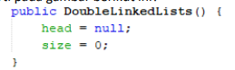
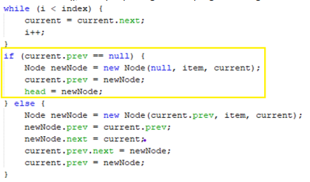
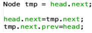
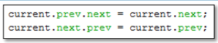
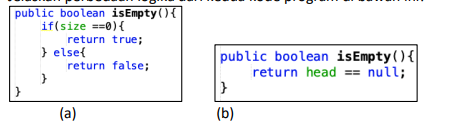

# 
  LAPORAN PRAKTIKUM ALGORITMA DAN STRUKTUR DATA 
 
# 
  JOBSHEET 12 
 
# 
  DOUBLE LINKED LIST 
 
    

    

     

 Nama : Tiara Mera Sifa 

 NIM  : 2341720247 

 Prodi: D-IV Teknik Informatika

 Kelas: 1B / 27 

     

# Praktikum
## 12.2.Percobaan 1
## 12.2.2 Verifikasi Hasil Percobaan
## 12.2.3 Pertanyaan Percobaan
1. Jelaskan perbedaan antara single linked list dengan double linked lists!
2. Perhatikan class Node, di dalamnya terdapat atribut next dan prev. Untuk apakah atribut 
tersebut?
3. Perhatikan konstruktor pada class DoubleLinkedLists. Apa kegunaan inisialisasi atribut head dan 

size seperti pada gambar berikut ini?
4. Pada method addFirst(), kenapa dalam pembuatan object dari konstruktor class Node prev 
dianggap sama dengan null?
Node newNode = new Node(null, item, head);
5. Perhatikan pada method addFirst(). Apakah arti statement head.prev = newNode ?
6. Perhatikan isi method addLast(), apa arti dari pembuatan object Node dengan mengisikan 
parameter prev dengan current, dan next dengan null?
Node newNode = new Node(current, item, null);
7. Pada method add(), terdapat potongan kode program sebagai berikut:
jelaskan maksud dari bagian yang ditandai dengan kotak kuning.

## 12.2.Percobaan 2
## 12.3.2 Verifikasi Hasil Percobaan
## 12.3.3 Pertanyaan Percobaan
1. Apakah maksud statement berikut pada method removeFirst()?
head = head.next;
head.prev = null;
2. Bagaimana cara mendeteksi posisi data ada pada bagian akhir pada method removeLast()?
3. Jelaskan alasan potongan kode program di bawah ini tidak cocok untuk perintah remove!

4. Jelaskan fungsi kode program berikut ini pada fungsi remove!

## 12.2.Percobaan 3
## 12.3.2 Verifikasi Hasil Percobaan
## 12.3.3 Pertanyaan Percobaan
1. Jelaskan method size() pada class DoubleLinkedLists!
2. Jelaskan cara mengatur indeks pada double linked lists supaya dapat dimulai dari indeks ke1!
3. Jelaskan perbedaan karakteristik fungsi Add pada Double Linked Lists dan Single Linked Lists! 
4. Jelaskan perbedaan logika dari kedua kode program di bawah ini!
