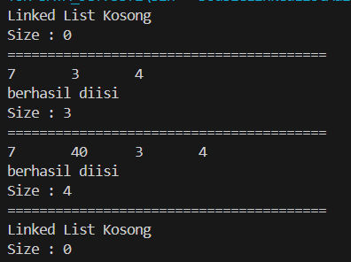
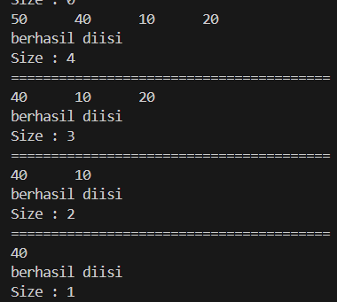

# 
  LAPORAN PRAKTIKUM ALGORITMA DAN STRUKTUR DATA 
 
# 
  JOBSHEET 12 
 
# 
  DOUBLE LINKED LIST 
 
    

    

     

 Nama : Tiara Mera Sifa 

 NIM  : 2341720247 

 Prodi: D-IV Teknik Informatika

 Kelas: 1B / 27 

     

# Praktikum
## 12.2.Percobaan 1

### class Node227.java

         public class Node227 {
            int data;
            Node227 prev, next;

            Node227(Node227 prev, int data, Node227 next) {
               this.prev = prev;
               this.data = data;
               this.next = next;
            }
         }
### class doubleLinkedList27.java

         public class DoubleLinkedList27 {
            Node227 head;
            int size;

            public DoubleLinkedList27() {
               head = null;
               size = 0;
            }

            public boolean isEmpty() {
               return head == null;
            }

            public void addFirst(int item) {
               if (isEmpty()) {
                     head = new Node227(null, item, null);
               } else {
                     Node227 newNode = new Node227(null, item, head);
                     head.prev = newNode;
                     head = newNode;
               }
               size++;
            }

            public void addLast(int item) {
               if (isEmpty()) {
                     addFirst(item);
               } else {
                     Node227 current = head;
                     while (current.next != null) {
                        current = current.next;
                     }
                     Node227 newNode = new Node227(current, item, null);
                     current.next = newNode;
                     size++;
               }
            }

            public void add(int item, int index) throws Exception {
               if (isEmpty()) {
                     addFirst(item);
               } else if (index < 0 || index > size) {
                     throw new Exception("Nilai indeks di luar batas");
               } else {
                     Node227 current = head;
                     int i = 0;
                     while (i < index) {
                        current = current.next;
                        i++;
                     }
                     if (current.prev == null) {
                        Node227 newNode = new Node227(null, item, current);
                        current.prev = newNode;
                        head = newNode;
                     } else {
                        Node227 newNode = new Node227(current.prev, item, current);
                        newNode.prev = current.prev;
                        newNode.next = current;
                        current.prev.next = newNode;
                        current.prev = newNode;
                     }
               }
               size++;
            }

            public int size() {
               return size;
            }

            public void clear() {
               head = null;
               size = 0;
            }

            public void print() {
               if (!isEmpty()) {
                     Node227 tmp = head;
                     while (tmp != null) {
                        System.out.print(tmp.data + "\t");
                        tmp = tmp.next;
                     }
                     System.out.println("\nberhasil diisi");
               } else {
                     System.out.println("Linked List Kosong");
               }
            }

### class doubleLinkedListMain.java

         public class DoubleLinkedListMain27 {
            public static void main(String[] args) throws Exception {
               
               DoubleLinkedList27 dll = new DoubleLinkedList27();
               dll.print();
               System.out.println("Size : " + dll.size());
               System.out.println("========================================");
               dll.addFirst(3);
               dll.addLast(4);
               dll.addFirst(7);
               dll.print();
               System.out.println("Size : " + dll.size());
               System.out.println("========================================");
               dll.add(40, 1);
               dll.print();
               System.out.println("Size : " + dll.size());
               System.out.println("========================================");
               dll.clear();
               dll.print();
               System.out.println("Size : " + dll.size());

## 12.2.2 Verifikasi Hasil Percobaan

## 12.2.3 Pertanyaan Percobaan
1. Jelaskan perbedaan antara single linked list dengan double linked lists!  
- Perbedaan single linked list dan double linked list yaitu jika single linked list hanya memiliki satu pointer dari node pertama ke node berikutnya, dan hanya bisa bergerak maju. Sedangkan Double linked list memiliki dua pointer, satu pointer ke node berikutnya dan satu ke node sebelumnya, dan bisa bergerak maju dan mundur

2. Perhatikan class Node, di dalamnya terdapat atribut next dan prev. Untuk apakah atribut 
tersebut? 
next untuk menunjuk ke node berikutnya
prev untuk menunjuk ke node sebelumnya

3. Perhatikan konstruktor pada class DoubleLinkedLists. Apa kegunaan inisialisasi atribut head dan 

size seperti pada gambar berikut ini?

4. Pada method addFirst(), kenapa dalam pembuatan object dari konstruktor class Node prev 
dianggap sama dengan null?
Node newNode = new Node(null, item, head);  
Karena newNode akan menjadi node pertama dalam daftar, dan tidak ada node sebelumnya sehingga prev juga diatur ke null.

5. Perhatikan pada method addFirst(). Apakah arti statement head.prev = newNode ?
Artinya adalah node yang saat ini menjadi head akan menjadi node kedua setelah penambahan node baru. Oleh karena itu perlu diatur untuk menunjuk ke node baru.

6. Perhatikan isi method addLast(), apa arti dari pembuatan object Node dengan mengisikan 
parameter prev dengan current, dan next dengan null?
Node newNode = new Node(current, item, null);
Node baru akan ditempatkan setelah node terakhir saat ini (current). Jadi pointer prev dan newNode harus menunjuk ke node terakhir. Lalu item adalah data yang disimpan dalam node baru. Lalu next = null, newNode akan menjadi node terakhir dalam daftar, tidak ada node berikutnya, sehingga next diatur ke null.

7. Pada method add(), terdapat potongan kode program sebagai berikut:
jelaskan maksud dari bagian yang ditandai dengan kotak kuning.

 
- Memeriksa apakah current adalah node pertama dalam linked list, jika current.prev == null, berarti tidak ada node sebelumnya dan current adalah node pertama.
- Membuat newNode 
- Mengatur pointer prev dari current untuk menunjuk ke newNode karena newNode sekarang menjadi node pertama dalam linked list.
- Lalu memperbaui head untuk menunjuk newNode, karena newNode sekarang menjadi node pertama dalam linked list.

## 12.2.Percobaan 2
### class DoubleLinkedList227.java
         public void removeFirst() throws Exception {
               if (isEmpty()) {
                     throw new Exception("Linked List masih kosong, tidak dapat dihapus!");
               } else if (size == 1) {
                     removeLast();
               } else {
                     head = head.next;
                     head.prev = null;
                     size--;
               }
            }

            public void removeLast() throws Exception{
               if (isEmpty()) {
                     throw new Exception("Linked List masih kosong, tidak dapat dihapus!");
               } else if (head.next == null) {
                     head = null;
                     size--;
                     return;
               }
               Node227 current = head;
               while (current.next.next != null) {
                     current = current.next;
               }
               current.next = null;
               size--;
            }

            public void remove (int index) throws Exception {
               if (isEmpty() || index >= size) {
                     throw new Exception("Nilai indeks di luar batas");
               } else if (index ==0) {
                     removeFirst();
               } else {
                     Node227 current = head;
                     int i = 0;
                     while (i < index) {
                        current = current.next;
                        i++;
                     }
                     if (current.next == null) {
                        current.prev.next = null;
                     } else if (current.prev == null) {
                        current = current.next;
                        current.prev = null;
                        head = current;
                     } else {
                        current.prev.next = current.next;
                        current.next.prev = current.prev;
                     }
                     size--;
               }
            }
## 12.3.2 Verifikasi Hasil Percobaan

## 12.3.3 Pertanyaan Percobaan
1. Apakah maksud statement berikut pada method removeFirst()?
head = head.next;
head.prev = null;
 
- head = head.next; adalah mengatur head menunjuk ke node berikutnya. Node pertama akan dihapus dan node kedua menjadi node pertama (head) yg baru.
- head.prev = null; setelah head diatur ke node berikutnya, node sebelumnya memliki pointer prev yg menunjuk ke node lama yang sudah dihapus. Maka dari itu head baru diatur menjadi null.

2. Bagaimana cara mendeteksi posisi data ada pada bagian akhir pada method removeLast()? 
Pada method removeLast(), dilakukan dengan while (current.next.next != null) untuk menemukan node kedua dari belakang, kemudian menghapus node terakhir dengan current.next = null;.

3. Jelaskan alasan potongan kode program di bawah ini tidak cocok untuk perintah remove!

Tidak cocok untuk removeFirst() karena tidak menangani penghapusan node pertama secara tepat, dan tidak cocok untuk removeLast() karena tidak mencakup logika traversal dan penghapusan node terakhir.

4. Jelaskan fungsi kode program berikut ini pada fungsi remove!

- current.prev.next = current.next; dan current.next.prev = current.prev; berfungsi untuk menghapus node current dari linked list

- current.prev.next = current.next; mengatur referensi next dari node sebelum current agar menunjuk ke node setelah curren

- current.next.prev = current.prev; mengatur referensi prev dari node setelah current agar menunjuk ke node sebelum current

## 12.2.Percobaan 3
### DoubleLinkedList27.java

         public int getFirst() throws Exception {
               if (isEmpty()) {
                     throw new Exception("Linked List Kosong");
               }
               return head.data;
            }

            public int getLast() throws Exception {
               if (isEmpty()) {
                     throw new Exception("Linked List Kosong");
               }
               Node227 tmp = head;
               while (tmp.next != null){
                     tmp = tmp.next;
               }
               return tmp.data;
            }

            public int get(int index) throws Exception {
               if (isEmpty() || index >= size)
               throw new Exception("Nilai indeks di luar batas.");
               Node227 tmp = head;
            for(int i= 0; i < index; i++) {
               tmp = tmp.next;
            }
            return tmp.data;
            }

### DoubleLinkedListMain.java

         dll.print();
               System.out.println("Size: " + dll.size());
               System.out.println("========================================");
               System.out.println("Data awal pada Linked List adalah: " + dll.getFirst());
               System.out.println("Data akhir pada Linked List adalah: "+ dll.getLast());
               System.out.println("Data indeks ke-1 pada Linked List adalah: " + dll.get(1));

## 12.3.2 Verifikasi Hasil Percobaan

## 12.3.3 Pertanyaan Percobaan
1. Jelaskan method size() pada class DoubleLinkedLists! 
Method size() digunakan untuk mengembalikan jumlah node yang ada dalam linked list.

2. Jelaskan cara mengatur indeks pada double linked lists supaya dapat dimulai dari indeks ke1!
      - Node227 current = head;
         for (int i = 1; i < index; i++) {
            current = current.next;
         }
         return current;

3. Jelaskan perbedaan karakteristik fungsi Add pada Double Linked Lists dan Single Linked Lists! 
4. Jelaskan perbedaan logika dari kedua kode program di bawah ini!
 
memeriksa apakah suatu struktur data (seperti linked list) kosong, tetapi mereka melakukannya dengan cara yang berbeda dan bergantung pada atribut yang berbeda

## TUGAS PRAKTIKUM
1. PROGRAM ANTRIAN VAKSINASI

2. DATA FILM LAYAR LEBAR
