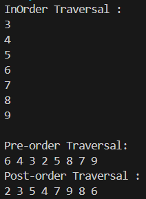

# 
  LAPORAN PRAKTIKUM ALGORITMA DAN STRUKTUR DATA 
 
# 
  JOBSHEET 14 
 
# 
  TREE 
 
    

    

     

 Nama : Tiara Mera Sifa 

 NIM  : 2341720247 

 Prodi: D-IV Teknik Informatika

 Kelas: 1B / 27 

     

# Praktikum
## 13.2.Percobaan 1
### class Node

      package Percobaan1;
      public class Node27 {
         int data;
         Node27 left;
         Node27 right;

         public Node27(){

         }

         public Node27(int data){
            this.data = data;
            this.left = null;
            this.right = null;
         }
      }

### class BinaryTree27.java

      package Percobaan1;
      public class BinaryTree27 {
         Node27 root;

      boolean isEmpty(){
         return root == null;
      }

      void add(int data) {
         if (isEmpty()) {
            root = new Node27(data);
         } else {
            Node27 current = root;
            while (true) {
                  if (data < current.data) {
                     if (current.left == null) {
                        current.left = new Node27(data);
                        break;
                     } else {
                        current = current.left;
                     }
                  } else if (data > current.data) {
                     if (current.right == null) {
                        current.right = new Node27(data);
                        break;
                     } else {
                        current = current.right;
                     }
                  } else {
                     break;
                  }
            }
         }
      }

      boolean find(int data) {
         Node27 current = root;
         boolean result = false;

         while (current != null) {
            // Jika data ditemukan pada node saat ini
            if (current.data == data) {
                  return true; // Elemen ditemukan
            } else if (data < current.data) {
                  current = current.left; // Pindah ke subtree kiri
            } else {
                  current = current.right; // Pindah ke subtree kanan
            }
         }
         return result;
      }

      void traversePreOrder(Node27 node) {
         if (node != null) {
            System.out.print(" " + node.data);
            traversePreOrder(node.left);
            traversePreOrder(node.right);
         }
      }

      void traversePostOrder(Node27 node) {
         if (node != null) {
            traversePostOrder(node.left);
            traversePostOrder(node.right);
            System.out.print(" " + node.data);
         }
      }

      void traverseInOrder(Node27 node) {
         if (node != null) {
            traverseInOrder(node.left);
            System.out.print(" " + node.data);
            traverseInOrder(node.right);
         }
      }

      Node27 getSuccessor(Node27 del){
         Node27 successor = del.right;
         Node27 successorParent = del;
         while(successor.left!= null){
            successorParent = successor;
            successor = successor.left;
         }
         if(successor != del.right){
            successorParent.left = successor.right;
            successor.right = del.right;
         }
         return successor;
      }

      public void delete(int data) {
         if (isEmpty()) {
            System.out.println("Tree is empty!");
            return;
         }

         Node27 parent = null;
         Node27 current = root;
         boolean isLeftChild = false;
         while (current != null && current.data != data) {
            parent = current;
            if (data < current.data) {
                  current = current.left;
                  isLeftChild = true;
            } else {
                  current = current.right;
                  isLeftChild = false;
            }
         }

         // Jika node tidak ditemukan
         if (current == null) {
            System.out.println("Couldn't find data!");
            return;
         }

         //tidak memiliki anak
         if (current.left == null && current.right == null) {
            if (current == root) {
                  root = null;
            } else if (isLeftChild) {
                  parent.left = null;
            } else {
                  parent.right = null;
            }
         }
         //satu anak (hanya anak kiri atau kanan)
         else if (current.right == null) { //nak kiri
            if (current == root) {
                  root = current.left;
            } else if (isLeftChild) {
                  parent.left = current.left;
            } else {
                  parent.right = current.left;
            }
         } else if (current.left == null) { // anak kanan
            if (current == root) {
                  root = current.right;
            } else if (isLeftChild) {
                  parent.left = current.right;
            } else {
                  parent.right = current.right;
            }
         }
         //dua anak
         else {
            Node27 successor = getSuccessor(current);
            if (current == root) {
                  root = successor;
            } else if (isLeftChild) {
                  parent.left = successor;
            } else {
                  parent.right = successor;
            }
            successor.left = current.left;
         }
      }

### class BinaryTreeMain27.java

      package Percobaan1;
      public class BinaryTreeMain27 {
         public static void main(String[] args) {
            BinaryTree27 bt = new BinaryTree27();
            bt.add(6);
            bt.add(4);
            bt.add(8);
            bt.add(3);
            bt.add(5);
            bt.add(7);
            bt.add(9);
            bt.add(10);
            bt.add(15);
            
            System.out.println("Pre Order Traversal: ");
            bt.traversePreOrder(bt.root);
            System.out.println();

            System.out.println("in Order Traversal: ");
            bt.traverseInOrder(bt.root);
            System.out.println();

            System.out.println("Post Order Traversal: ");
            bt.traversePostOrder(bt.root);
            System.out.println();
            
            System.out.println("Find Node :" +bt.find(5));
            System.out.println("Delete node 8 ");
            bt.delete(8);
            System.out.println(" ");
            System.out.println("Pre Order Traversal: ");
            bt.traversePreOrder(bt.root);
            System.out.println("");
            
         }
      }

## 13.2.2 Verifikasi Hasil Percobaan

## 13.2.3 Pertanyaan Percobaan
1. Mengapa dalam binary search tree proses pencarian data bisa lebih efektif dilakukan dibanding 
binary tree biasa? 
Karena di Binary Search Tree, setiap node memiliki nilai yang lebih kecil dari semua nilai di subtree kanannya dan lebih besar dari semua nilai di subtree kirinya, sehingga  pencarian data dapat dilakukan dengan efisien karena kita dapat mengecek hanya satu sisi dari setiap node saat kita melakukan pencarian.

2. Untuk apakah di class Node, kegunaan dari atribut left dan right? 
Atribut left digunakan untuk menunjukkan anak kiri dari suatu node, sedangkan atribut right digunakan untuk menunjukkan anak kanan dari suatu node

3. a. Untuk apakah kegunaan dari atribut root di dalam class BinaryTree? 
Atribut root di dalam class BinaryTree digunakan untuk menunjukkan node akar dari pohon biner.

b. Ketika objek tree pertama kali dibuat, apakah nilai dari root? 
Ketika objek tree pertama kali dibuat, nilai dari root akan null karena pada awalnya pohon kosong.

4. Ketika tree masih kosong, dan akan ditambahkan sebuah node baru, proses apa yang akan terjadi? 
Jika tree masih kosong dan akan ditambahkan sebuah node baru, maka node tersebut akan menjadi akar dari pohon tersebut. Artinya, nilai dari node tersebut akan diatur sebagai root.

5. Perhatikan method add(), di dalamnya terdapat baris program seperti di bawah ini. Jelaskan 
secara detil untuk apa baris program tersebut?

         if(data<current.data){
         if(current.left!=null){
         current = current.left;
         }else{
         current.left = new Node(data);
         break;
         }
         }

 

-Jika nilai data yang ingin ditambahkan lebih kecil dari nilai data node saat ini, maka program akan lanjut.
-Jika sudah ada anak kiri dari node saat ini, pindah ke anak kiri tersebut.
-Jika belum ada anak kiri, tambahkan node baru sebagai anak kiri dari node saat ini.
-Buat node baru dengan nilai data yang ingin ditambahkan dan jadikan sebagai anak kiri dari node saat ini.
-Keluar dari proses penambahan node karena sudah tepat.

# Praktikum
## 13.2.Percobaan 2

### class BinaryTreeArray27.java

         package Percobaan2;

         public class BinaryTreeAray27 {
            int[] data;
            int idxLast;

            public BinaryTreeAray27(){
               data = new int[10];
            }

            void populateData(int data[], int idxLast){
               this.data = data;
               this.idxLast = idxLast;
            }

            void traverseInOrder(int idxStart){
               if(idxStart <= idxLast){
                     traverseInOrder(2*idxStart+1);
                     System.out.println(data[idxStart]+"");
                     traverseInOrder(2*idxStart+2);
               }
            }

### class BinaryTreeArray27Main.java

package Percobaan2;

         public class BinaryTreeArrayMain27 {
            public static void main(String[] args) {
               BinaryTreeAray27 bta = new BinaryTreeAray27();
               int[] data = {6, 4, 8, 3, 5, 7, 9,0, 0, 0};
               int idxLast = 6;
               bta.populateData(data, idxLast);
               System.out.println("\nInOrder Traversal : ");
               bta.traverseInOrder(0);
               System.out.println("\n");
            }
         }

## 13.2.2 Verifikasi Hasil Percobaan

## 13.2.3 Pertanyaan Percobaan
1. Apakah kegunaan dari atribut data dan idxLast yang ada di class BinaryTreeArray? 
Atribut data digunakan untuk menyimpan elemen dalam bentuk array, sedangkan idxLast digunakan untuk menyimpan indeks terakhir yang digunakan dlm array.

2. Apakah kegunaan dari method populateData()? 
Kegunaan method populateData() yaitu untuk mengisi array 'data' dengan nilai-nilai yang diberikan serta mengatur idxLast dgn jumlah elemen yg ada.

3. Apakah kegunaan dari method traverseInOrder()?
Kegunaan method traverseInOrder() yaitu untuk melakukan traversal in-order pada binary tree yang diimplementasikan menggunakan array. Traversal in-order mengunjungi node-node dalam binary tree dalam urutan kiri-akar-kanan
4. Jika suatu node binary tree disimpan dalam array indeks 2, maka di indeks berapakah posisi 
left child dan rigth child masin-masing?
posisi left child akan berada di indeks 2*2 + 1 = 5,  
posisi left child akan berada di indeks 2*1 +2 = 6,
5. Apa kegunaan statement int idxLast = 6 pada praktikum 2 percobaan nomor 4? 
Menunjukkan bahwa dalam percobaan tersebut, ada total 7 elemen dalam binary tree dan elemen yg terakhir berada di indeks ke 6.
## 13.4 Tugas Praktikum
1. Buat method di dalam class BinaryTree yang akan menambahkan node dengan cara 
rekursif.

         void tambahRekursif(Node27 current, int data){ // TUGAS 1
            if (current == null) {
               current = new Node27(data); 
            } else {
               // Jika data kurang dari data node current, periksa subtree kiri
               if (data < current.data) {
                     if (current.left != null) {
                        tambahRekursif(current.left, data);
                     } else {
                        current.left = new Node27(data);
                     }
               }
               // Jika data lebih dari data node current, subtree kanan
               else if (data > current.data) {
                     if (current.right != null) {
                        tambahRekursif(current.right, data);
                     } else {
                        current.right = new Node27(data);
                     }
               }
            }

         }

2. Buat method di dalam class BinaryTree untuk menampilkan nilai paling kecil dan yang 
paling besar yang ada di dalam tree.

         int cariMin(){ //TUGAS 2
            Node27 current = root;
            while (current.left != null) {
               current = current.left;
            }
            return current.data;
         }

         int cariMax(){ // TUGAS 2
            Node27 current = root;
            while (current.right != null) {
               current = current.right;
            }
            return current.data;
         }  

3. Buat method di dalam class BinaryTree untuk menampilkan data yang ada di leaf.

         void tampilDataLeaf(Node27 node) { // TUGAS 3
            if (node != null) {
               if (node.left == null && node.right == null) {
                     System.out.print(node.data +" ");
               } else {
                     tampilDataLeaf(node.left);
                     tampilDataLeaf(node.right);
               }
            }
         }

4. Buat method di dalam class BinaryTree untuk menampilkan berapa jumlah leaf yang ada 
di dalam tree.

         int tampilJumlahLeaf(Node27 node) { // TUGAS 4
            if (node != null) {
               return 0;
            }else if (node.left == null && node.right == null) {
               System.out.println(" " + node.data);
               return 1;
            } else {
               return tampilJumlahLeaf(node.left) + tampilJumlahLeaf(node.right);
            }
         }

5. Modifikasi class BinaryTreeArray, dan tambahkan : 
• method add(int data) untuk memasukan data ke dalam tree 

         void add(int data){ // TUGAS NO 5A
               if (idxLast == this.data.length - 1) {
                     System.out.println("Binary Tree is full");
                     return;
               }
               idxLast++;
               this.data[idxLast] = data;
            }

• method traversePreOrder() dan traversePostOrder()

         void traversePreOrder(int idxStart){ // TUGAS NO 5B
            if (idxStart <= idxLast && data[idxStart] != 0) {
                  System.out.print(this.data[idxStart] + " ");
                  traversePreOrder(2 * idxStart + 1);
                  traversePreOrder(2 * idxStart + 2);
            }
         }

         void traversePostOrder(int idxStart){ // TUGAS NO 5B
            if (idxStart <= idxLast && data[idxStart] != 0) {
                  traversePostOrder(2 * idxStart + 1);
                  traversePostOrder(2 * idxStart + 2);
                  System.out.print(this.data[idxStart] + " ");
            }
         }

## Verifikasi Hasil Percobaan

