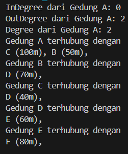
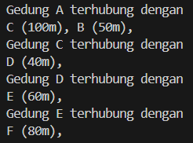
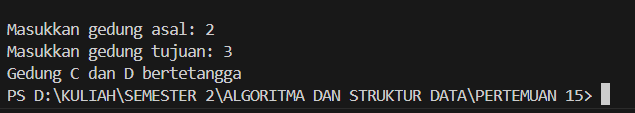
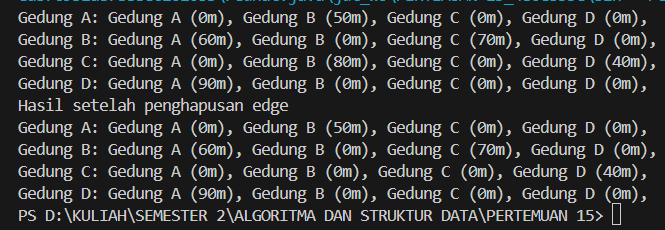
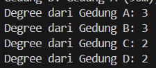
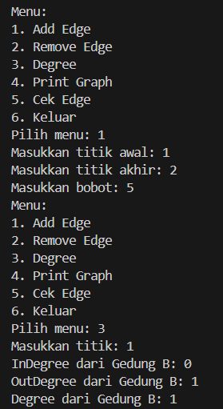
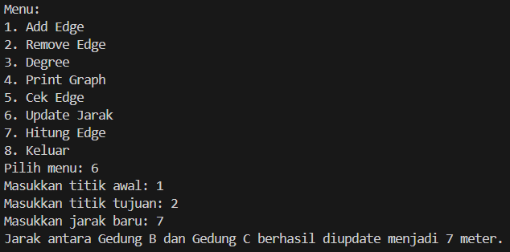
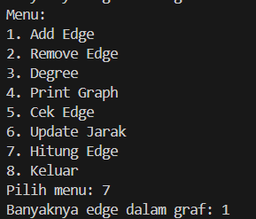

# 
  LAPORAN PRAKTIKUM ALGORITMA DAN STRUKTUR DATA 
 
# 
  JOBSHEET 15 
 
# 
  GRAPH 
 
    

    

     

 Nama : Tiara Mera Sifa 

 NIM  : 2341720247 

 Prodi: D-IV Teknik Informatika

 Kelas: 1B / 27 

     

# Praktikum
## 2.1.Percobaan 1 Implementasi Graph menggunakan Linked List
### class DoubleLinkedList27.java

         public class DoubleLinkedList27 {
            Node27 head;
            int size;

            public DoubleLinkedList27() {
               head = null;
               size = 0;
            }

            public boolean isEmpty() {
               return head == null;
            }

            public void addFirst(int item, int jarak) {
               if (isEmpty()) {
                     head = new Node27(null, item, jarak, null);
               } else {
                     Node27 newNode = new Node27(null, item, jarak, head);
                     head.prev = newNode;
                     head = newNode;
               }
               size++;
            }

            public void addLast(int item, int jarak) {
               if (isEmpty()) {
                     addFirst(item, jarak);
               } else {
                     Node27 current = head;
                     while (current.next != null) {
                        current = current.next;
                     }
                     Node27 newNode = new Node27(current, item, jarak, null);
                     current.next = newNode;
                     size++;
               }
            }

            public void add(int item, int jarak, int index) throws Exception {
               if (isEmpty()) {
                     addFirst(item, jarak);
               } else if (index < 0 || index > size) {
                     throw new Exception("Nilai indeks di luar batas");
               } else if (index == 0) {
                     addFirst(item, jarak);
               } else {
                     Node27 current = head;
                     int i = 0;
                     while (i < index - 1 && current.next != null) {
                        current = current.next;
                        i++;
                     }
                     Node27 newNode = new Node27(current, item, jarak, current.next);
                     if (current.next != null) {
                        current.next.prev = newNode;
                     }
                     current.next = newNode;
                     size++;
               }
            }
            

            public int size() {
               return size;
            }

            public void clear() {
               head = null;
               size = 0;
            }

            public void print() {
               if (!isEmpty()) {
                     Node27 tmp = head;
                     while (tmp != null) {
                        System.out.print(tmp.data + "\t");
                        tmp = tmp.next;
                     }
                     System.out.println("\nberhasil diisi");
               } else {
                     System.out.println("Linked List Kosong");
               }
            } //

            public void removeFirst() throws Exception {
               if (isEmpty()) {
                     throw new Exception("Linked List masih kosong, tidak dapat dihapus!");
               } else if (size == 1) {
                     removeLast();
               } else {
                     head = head.next;
                     head.prev = null;
                     size--;
               }
            }

            public void removeLast() throws Exception{
               if (isEmpty()) {
                     throw new Exception("Linked List masih kosong, tidak dapat dihapus!");
               } else if (head.next == null) {
                     head = null;
                     size--;
                     return;
               }
               Node27 current = head;
               while (current.next.next != null) {
                     current = current.next;
               }
               current.next = null;
               size--;
            }

            public void remove (int index){
                     Node27 current = head;
                     while (current != null) {
                        if(current.data == index){
                           if(current.prev != null) {
                                 current.prev.next = current.next;
                           } else {
                                 head = current.next;
                           }
                           if (current.next != null) {
                                 current.next.prev = current.prev;
                           }
                           break;
                        }
                        current = current.next;
                     }
                     size--;
                     
               }

            public int getFirst() throws Exception {
               if (isEmpty()) {
                     throw new Exception("Linked List Kosong");
               }
               return head.data;
            }

            public int getLast() throws Exception {
               if (isEmpty()) {
                     throw new Exception("Linked List Kosong");
               }
               Node27 tmp = head;
               while (tmp.next != null){
                     tmp = tmp.next;
               }
               return tmp.data;
            }

            public int get(int index) throws Exception {
               if (isEmpty() || index >= size)
               throw new Exception("Nilai indeks di luar batas.");
               Node27 tmp = head;
            for(int i= 0; i < index; i++) {
               tmp = tmp.next;
            }
            return tmp.data;
            }

            public int getJarak(int index) throws Exception {
               if(isEmpty() || index >= size) {
                     throw new Exception("Nilai indeks diluar batas");
               }
               Node27 tmp = head;
               for (int i = 0; i< index; i++) {
                     tmp = tmp.next;
               }
               return tmp.jarak;
            }
         }

### class Node27.java

         public class Node27 {
            int data;
            Node27 prev, next;
            int jarak;

            Node27(Node27 prev, int data, int jarak, Node27 next) {
               this.prev = prev;
               this.data = data;
               this.next = next;
               this.jarak = jarak;
            }
         }

### class Graph27.java

         public class Graph27 {
            int vertex;
            DoubleLinkedList27 list[];

            public Graph27(int v) {
               vertex = v;
               list = new DoubleLinkedList27[v];
               for (int i = 0; i < v; i++) {
                     list[i] = new DoubleLinkedList27();
               }
            }

            public void addEdge(int asal, int tujuan, int jarak) {
               list[asal].addFirst(tujuan, jarak);
            }

            public void degree (int asal) throws Exception {
               int k, totalIn=0, totalOut=0;
               for (int i=0; i < vertex; i++) {
                     //inDegree
                     for(int j = 0; j < list[i].size; j++) {
                        if (list[i].get(j) == asal) {
                           ++totalIn;
                        }
                     }
                     //outDegree
                     for(k=0; k < list[asal].size(); k++){
                        list[asal].get(k);
                     }
                     totalOut = k;
               }
               System.out.println("InDegree dari Gedung " + (char) ('A' + asal) + ": " + totalIn );
               System.out.println("OutDegree dari Gedung " + (char) ('A' + asal) + ": " + totalOut );
               System.out.println("Degree dari Gedung " + (char) ('A' + asal) + ": " + (totalIn + totalOut));
            }

            public void removeEdge(int asal, int tujuan) throws Exception {
               for (int i= 0; i< vertex; i++) {
                     if (i == tujuan) {
                        list[asal].remove(tujuan);
                     }
               }
            }

            public void removeAllEdges(){
               for (int i = 0; i < vertex; i++) {
                     list[i].clear();
               }
               System.out.println("Graf berhasil dikosongkan");
            }

            public void printGraph() throws Exception {
               for (int i=0; i < vertex; i++) {
                     if(list[i].size() > 0) {
                        System.out.println("Gedung " + (char) ('A' + i) + " terhubung dengan ");
                        for (int j= 0; j < list[i].size(); j++) {
                           System.out.print((char) ('A' + list[i].get(j)) + " (" + list[i].getJarak(j) + "m), ");
                        }
                        System.out.println("");
                     }
               }
               System.out.println("");
            }
         }

### class GraphMain.java

         public class GraphMain27 {
            public static void main(String[] args) throws Exception {
               Graph27 gedung = new Graph27(6);
               gedung.addEdge(0,1 , 50);
               gedung.addEdge(0,2 , 100);
               gedung.addEdge(1,3 , 70);
               gedung.addEdge(2,3 , 40);
               gedung.addEdge(3,4 , 60);
               gedung.addEdge(4,5 , 80);
               gedung.degree(0);
               gedung.printGraph();

               gedung.removeEdge(1, 3);
               gedung.printGraph();
            }
         }

## 2.1.2 Verfikasi hasil percobaan
### Hasil Running pada langkah 14

### Hasil Running pada langkah 17

## 2.1.3 Pertanyaan
1. Perbaiki kode program Anda apabila terdapat error atau hasil kompilasi kode tidak sesuai! 
sudah
2. Pada class Graph, terdapat atribut list[] bertipe DoubleLinkedList. Sebutkan tujuan pembuatan 
variabel tersebut! 
Tujuan atribut list[] yaitu untuk menyimpan semua tepi yang terhubung dalam simpul graf.
3. Jelaskan alur kerja dari method removeEdge! 
- Menggunakan parameter masukan berupa asal dan tujuan
- Memulai perulangan dari i = 0 sapai i < vertex.Dan setiap perulangan memeriksa apakah i == tujuan.
- Jika i== tujuan, maka method akan menghapus simpul tujuan dari linkedlist
4. Apakah alasan pemanggilan method addFirst() untuk menambahkan data, bukan method add 
jenis lain saat digunakan pada method addEdge pada class Graph? 
Efisiensi waktu dan pengimplementasian yang sederhana
5. Modifikasi kode program sehingga dapat dilakukan pengecekan apakah terdapat jalur antara 
suatu node dengan node lainnya, seperti contoh berikut (Anda dapat memanfaatkan Scanner). 
### Graph27.java

         public class Graph27 {
            int vertex;
            DoubleLinkedList27 list[];

            public Graph27(int v) {
               vertex = v;
               list = new DoubleLinkedList27[v];
               for (int i = 0; i < v; i++) {
                     list[i] = new DoubleLinkedList27();
               }
            }

            public void addEdge(int asal, int tujuan, int jarak) {
               list[asal].addFirst(tujuan, jarak);
            }

            public void degree (int asal) throws Exception {
               int k, totalIn=0, totalOut=0;
               for (int i=0; i < vertex; i++) {
                     //inDegree
                     for(int j = 0; j < list[i].size; j++) {
                        if (list[i].get(j) == asal) {
                           ++totalIn;
                        }
                     }
                     //outDegree
                     for(k=0; k < list[asal].size(); k++){
                        list[asal].get(k);
                     }
                     totalOut = k;
               }
               System.out.println("InDegree dari Gedung " + (char) ('A' + asal) + ": " + totalIn );
               System.out.println("OutDegree dari Gedung " + (char) ('A' + asal) + ": " + totalOut );
               System.out.println("Degree dari Gedung " + (char) ('A' + asal) + ": " + (totalIn + totalOut));
            }

            public void removeEdge(int asal, int tujuan) throws Exception {
               for (int i= 0; i< vertex; i++) {
                     if (i == tujuan) {
                        list[asal].remove(tujuan);
                     }
               }
            }

            public void removeAllEdges(){
               for (int i = 0; i < vertex; i++) {
                     list[i].clear();
               }
               System.out.println("Graf berhasil dikosongkan");
            }

            public void printGraph() throws Exception {
               for (int i=0; i < vertex; i++) {
                     if(list[i].size() > 0) {
                        System.out.println("Gedung " + (char) ('A' + i) + " terhubung dengan ");
                        for (int j= 0; j < list[i].size(); j++) {
                           System.out.print((char) ('A' + list[i].get(j)) + " (" + list[i].getJarak(j) + "m), ");
                        }
                        System.out.println("");
                     }
               }
               System.out.println("");
            }

            public boolean cekTetangga(int asal, int tujuan) throws Exception{
               for (int i = 0; i < list[asal].size(); i++) {
                     if (list[asal].get(i) == tujuan) {
                        return true;
                     }
               }
               return false;
            }
         }

### GraphMain27.java

         // Tugas no 5
               System.out.print("Masukkan gedung asal: ");
               int asal = sc27.nextInt();

               System.out.print("Masukkan gedung tujuan: ");
               int tujuan = sc27.nextInt();

               boolean tetangga = gedung.cekTetangga(asal, tujuan);
               char gedungAsal = (char) ('A' + asal);
               char gedungTujuan = (char) ('A' + tujuan);
               
               if (tetangga) {
                     System.out.println("Gedung " + gedungAsal + " dan " + gedungTujuan + " bertetangga");
               } else {
                     System.out.println("Gedung " + gedungAsal + " dan " + gedungTujuan + " tidak bertetangga");
               }
    

### Verifikasi Hasil Percobaan

## 2.1.Percobaan 2 Implementasi Graph menggunakan Matriks

### GraphMatriks27.java
         package Percobaan2;

         public class GraphMatriks27 {
            int vertex;
            int [][] matriks;

            public GraphMatriks27(int v){
               vertex = v;
               matriks = new int [v] [v];
            }

            public void makeEdge(int asal, int tujuan, int jarak) {
               matriks[asal][tujuan] = jarak;
            }

            public void removeEdge(int asal, int tujuan) {
               matriks[asal][tujuan] = 0;
            }

            public void printGraph() {
               for (int i=0; i < vertex; i++) {
                        System.out.print("Gedung " + (char) ('A' + i) + ": ");
                        for (int j= 0; j < vertex; j++) {
                           if (matriks [i] [j] != -1){
                           System.out.print("Gedung " + (char) ('A' + j) + " (" + matriks[i][j] + "m), "); 
                        }
                        }
                        System.out.println();
                     }
               }

         }

### GraphMain27.java

         package Percobaan2;

         public class GraphMain27 {
            public static void main(String[] args) {
               GraphMatriks27 gdg = new GraphMatriks27(4);
               gdg.makeEdge(0, 1, 50);
               gdg.makeEdge(1, 0, 60);
               gdg.makeEdge(1, 2, 70);
               gdg.makeEdge(2, 1, 80);
               gdg.makeEdge(2, 3, 40);
               gdg.makeEdge(3, 0, 90);
               gdg.printGraph();
               System.out.println("Hasil setelah penghapusan edge");
               gdg.removeEdge(2, 1);
               gdg.printGraph();
            }
         }

## 2.1.2 Verfikasi hasil percobaan

## 2.2.3 Pertanyaan 
1. Perbaiki kode program Anda apabila terdapat error atau hasil kompilasi kode tidak sesuai! 
sudah
2. Apa jenis graph yang digunakan pada Percobaan 2? 
graph yang digunakan pada percobaan 2 adalah jenis graph berarah

3. Apa maksud dari dua baris kode berikut?

         gdg.makeEdge(1, 2, 70);
            gdg.makeEdge(2, 1, 80);
      
 
Baris tersebut memanggil method MakeEdge pada sebuah objek yang bernama gdg.
Pada baris pertama menambahkan sebuah tepi simpul 1 ke simpul 2 dengan jarak 70.
Pada baris kedua menabahkan sebuah tepi simpul 2 ke simpul 1 dengan jarak 80.

4. Modifikasi kode program sehingga terdapat method untuk menghitung degree, termasuk 
inDegree dan outDegree!

### graphMatriks27.java

            public int inDegree(int vertex) {
               int inDegree = 0;
               for (int i = 0; i < this.vertex; i++) {
                     if (matriks[i][vertex] != 0) { // Cek apakah ada tepi masuk ke vertex
                        inDegree++;
                     }
               }
                     return inDegree;
               }

            public int outDegree(int vertex) {
               int outDegree = 0;
               for (int j = 0; j < this.vertex; j++) {
                     if (matriks[vertex][j] != 0) { // Cek apakah ada tepi keluar dari vertex
                        outDegree++;
                     }
               }
                     return outDegree;
               }

            public int degree(int vertex){
               return outDegree(vertex) + inDegree(vertex);

            }

### graphMain27.java

         for (int i = 0; i < 4; i++) {
                     System.out.println("Degree dari Gedung " + (char) ('A' + i) + ": " + gdg.degree(i));
               }

### verifikasi hasil percobaan

## Latihan Praktikum 
1. Modifikasi kode program pada class GraphMain sehingga terdapat menu program yang bersifat 
dinamis, setidaknya terdiri dari:
a) Add Edge
b) Remove Edge
c) Degree
d) Print Graph
e) Cek Edge

### class Main.java

         //Modif
            boolean exit = false;

               while (!exit) {
                     System.out.println("Menu:");
                     System.out.println("1. Add Edge");
                     System.out.println("2. Remove Edge");
                     System.out.println("3. Degree");
                     System.out.println("4. Print Graph");
                     System.out.println("5. Cek Edge");
                     System.out.println("6. Keluar");
                     System.out.print("Pilih menu: ");
                     int menu = sc27.nextInt();

                     switch (menu) {
                        case 1:
                           System.out.print("Masukkan titik awal: ");
                           int awal = sc27.nextInt();
                           System.out.print("Masukkan titik akhir: ");
                           int akhir = sc27.nextInt();
                           System.out.print("Masukkan bobot: ");
                           int bobot = sc27.nextInt();
                           gedung.addEdge(awal, akhir, bobot);
                           break;
                        case 2:
                           System.out.print("Masukkan titik awal: ");
                           int removeAwal = sc27.nextInt();
                           System.out.print("Masukkan titik akhir: ");
                           int removeAkhir = sc27.nextInt();
                           gedung.removeEdge(removeAwal, removeAkhir);
                           break;
                        case 3:
                           System.out.print("Masukkan titik: ");
                           int titik = sc27.nextInt();
                           gedung.degree(titik);
                           break;
                        case 4:
                           gedung.printGraph();
                           break;
                        case 5:
                           System.out.print("Masukkan titik awal: ");
                           int asal = sc27.nextInt();
                           System.out.print("Masukkan titik tujuan: ");
                           int tujuan = sc27.nextInt();
                           boolean tetangga = gedung.cekTetangga(asal, tujuan);
                           char gedungAsal = (char) ('A' + asal);
                           char gedungTujuan = (char) ('A' + tujuan);
                           if (tetangga) {
                                 System.out.println("Gedung " + gedungAsal + " dan " + gedungTujuan + " bertetangga");
                           } else {
                                 System.out.println("Gedung " + gedungAsal + " dan " + gedungTujuan + " tidak bertetangga");
                           }
                           break;
                        case 6:
                           exit = true;
                           break;
                        default:
                           System.out.println("Pilihan tidak valid.");
                           break;
                     }
               }
Pengguna dapat memilih menu program melalui input Scanner

### verifikasi hasil percobaan

2. Tambahkan method updateJarak pada Percobaan 1 yang digunakan untuk mengubah jarak 
antara dua node asal dan tujuan!  

         public void updateJarak(int asal, int tujuan, int jarakBaru) {
            try {
                  int index = -1;
                  // Mencari index tujuan di dalam list[asal]
                  for (int i = 0; i < list[asal].size(); i++) {
                     if (list[asal].get(i) == tujuan) {
                        index = i;
                        break;
                     }
                  }
                  if (index != -1) {
                     // Update jarak
                     list[asal].setJarak(index, jarakBaru);
                     System.out.println("Jarak antara Gedung " + (char) ('A' + asal) + " dan Gedung " + (char) ('A' + tujuan)
                              + " berhasil diupdate menjadi " + jarakBaru + " meter.");
                  } else {
                     System.out.println(
                              "Tidak dapat memperbarui jarak: Gedung " + (char) ('A' + asal) + " tidak terhubung dengan Gedung " + (char) ('A' + tujuan));
                  }
            } catch (Exception e) {
                  System.out.println("Terjadi kesalahan saat memperbarui jarak: " + e.getMessage());
            }
         }

### Verifikasi Hasil Percobaan
         

3. Tambahkan method hitungEdge untuk menghitung banyaknya edge yang terdapat di dalam graf! 

         public int hitungEdge() {
               int totalEdge = 0;
               for (int i = 0; i < vertex; i++) {
                     totalEdge += list[i].size();
               }
               return totalEdge;
            }

### Verifikasi Hasil Percobaan

