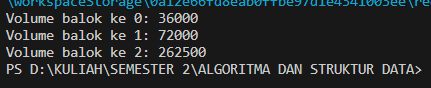

# 
  LAPORAN PRAKTIKUM ALGORITMA DAN STRUKTUR DATA 
 
# 
  JOBSHEET 3 
 
    

    

     

 Nama : Tiara Mera Sifa 

 NIM  : 2341720247 

 Prodi: D-IV Teknik Informatika

 Kelas: 1B / 27 

     

# Praktikum
## 3.2 Membuat Array dari Object, Mengisi dan Menampilkan

## 3.2.2 Verifikasi Hasil Percobaan

## 3.2.3 Pertanyaan
1. Berdasarkan uji coba 3.2, apakah class yang akan dibuat array of object harus selalu memiliki atribut dan sekaligus method?Jelaskan!  Tidak, jadi setiap class yang akan dibuat sebagai array tidak wajib memiliki atribut dan method. Mehod dan atribut diberikan sesuai kebutuhan program

2. Apakah class PersegiPanjang memiliki konstruktor?Jika tidak, kenapa dilakukan pemanggilan konstruktur pada baris program berikut :
    tidak memiliki konstruktor, ppArray[0] = new PersegiPanjang(); digunakan untuk instance objek ppArray dengan indeks ke 0
3. Apa yang dimaksud dengan kode berikut ini: 
    kode berikut berisi kode instance array PersegiPanjang dengan panjang 3
4. Apa yang dimaksud dengan kode berikut ini: 
    ppArray[1] = new PersegiPanjang(); //instance objek persegi panjang pada indeks 0
    ppArray[1].panjang = 80;
    ppArray[1].lebar = 40; 
    Kode diatas berisi pengisian nilai atribut untuk panjang dan lebar dari objek ppArray di indeks ke-1.

5. Mengapa class main dan juga class PersegiPanjang dipisahkan pada uji coba 3.2? 
Agar terstruktur dan lebih rapi, serta memisahkan tanggung jawab antar kode.

## 3.3 Menerima Input Isian Array Menggunakan Looping

## 3.3.2 Verifikasi Hasil Percobaan

## 3.3.3 Pertanyaan
1. Apakah array of object dapat diimplementasikan pada array 2 Dimensi? 
bisa, array of object dapat diimplementasikan dalam bentuk array 2 dimensi.
2. Jika jawaban soal no satu iya, berikan contohnya! Jika tidak, jelaskan! 

            public class Mahasiswa {
            String nama;
            int umur;

            public Mahasiswa(String nama, int umur) {
            this.nama = nama;
            this.umur = umur;
            }
            }

            public class Main {
            public static void main(String[] args) {
            // Membuat array 2 dimensi dari objek Mahasiswa
            Mahasiswa[][] dataMahasiswa = new Mahasiswa[2][3];

                // Inisialisasi objek-objek Mahasiswa dalam array 2 dimensi
                dataMahasiswa[0][0] = new Mahasiswa("John", 20);
                dataMahasiswa[0][1] = new Mahasiswa("Jane", 22);
                dataMahasiswa[0][2] = new Mahasiswa("Doe", 21);
                dataMahasiswa[1][0] = new Mahasiswa("Alice", 23);
                dataMahasiswa[1][1] = new Mahasiswa("Bob", 24);
                dataMahasiswa[1][2] = new Mahasiswa("Eve", 25);

                // Mengakses dan menampilkan data
                for (int i = 0; i < dataMahasiswa.length; i++) {
                    for (int j = 0; j < dataMahasiswa[i].length; j++) {
                        System.out.println("Nama: " + dataMahasiswa[i][j].nama + ", Umur: " + dataMahasiswa[i][j].umur);
                    }
                }
            }
            }

3. Jika diketahui terdapat class Persegi yang memiliki atribut sisi bertipe integer, maka kode 
dibawah ini akan memunculkan error saat dijalankan. Mengapa? 
Karena kode tersebut berupa deklarasi, sedangkan elemennya tidak di inisialisasi
4. Modifikasi kode program pada praktikum 3.3 agar length array menjadi inputan dengan Scanner! 

5. Apakah boleh Jika terjadi duplikasi instansiasi array of objek, misalkan saja instansiasi dilakukan 
pada ppArray[i] sekaligus ppArray[0]?Jelaskan ! 
    boleh, tapi nilainya akan tertumpuk-tumpuk.
## 3.4 Operasi Matematika Atribut Object Array

## 3.4.2 Verifikasi Hasil Percobaan

## 3.4.3 Pertanyaan
1. Dapatkah konstruktor berjumlah lebih dalam satu kelas? Jelaskan dengan contoh!  
bisa, sesuai dengan kebutuhan.
2. Jika diketahui terdapat class Segitiga seperti berikut ini: 
 
Tambahkan konstruktor pada class Segitiga tersebut yang berisi parameter int a, int t
yang masing-masing digunakan untuk mengisikan atribut alas dan tinggi. 

3. Tambahkan method hitungLuas() dan hitungKeliling() pada class Segitiga
tersebut. 

4. Pada fungsi main, buat array Segitiga sgArray yang berisi 4 elemen, isikan masing-masing 
atributnya sebagai berikut:
sgArray ke-0 alas: 10, tinggi: 4
sgArray ke-1 alas: 20, tinggi: 10
sgArray ke-2 alas: 15, tinggi: 6
sgArray ke-3 alas: 25, tinggi: 10

5. Kemudian menggunakan looping, cetak luas dan keliling dengan cara memanggil method 
hitungLuas() dan hitungKeliling(). 

# 3.5 Latihan Praktikum

1. ## Kode

## Hasil
!\[alt text\](img/image4.png)
2. ## Kode

## Hasil

