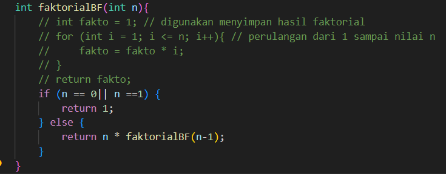
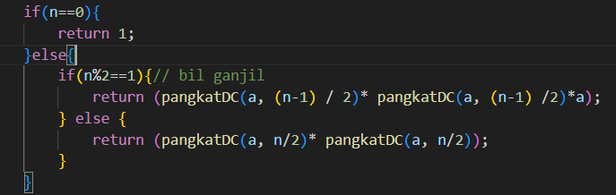
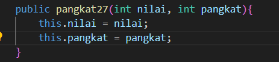
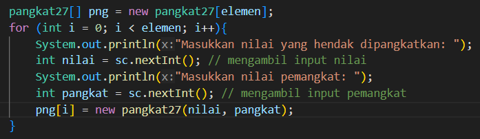
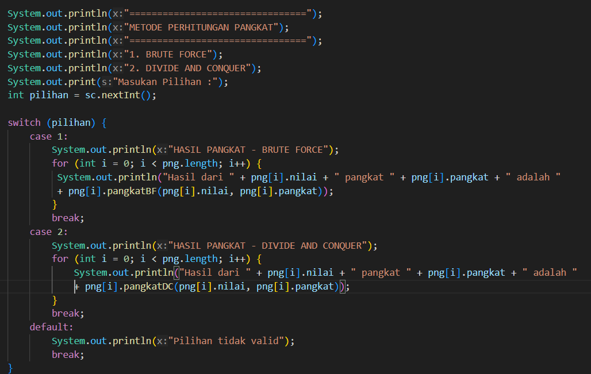
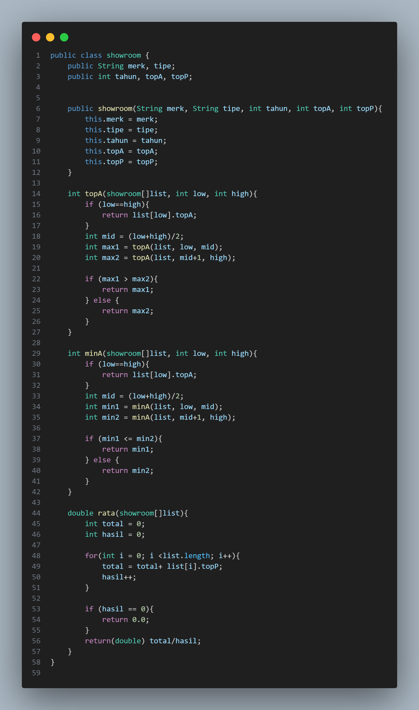
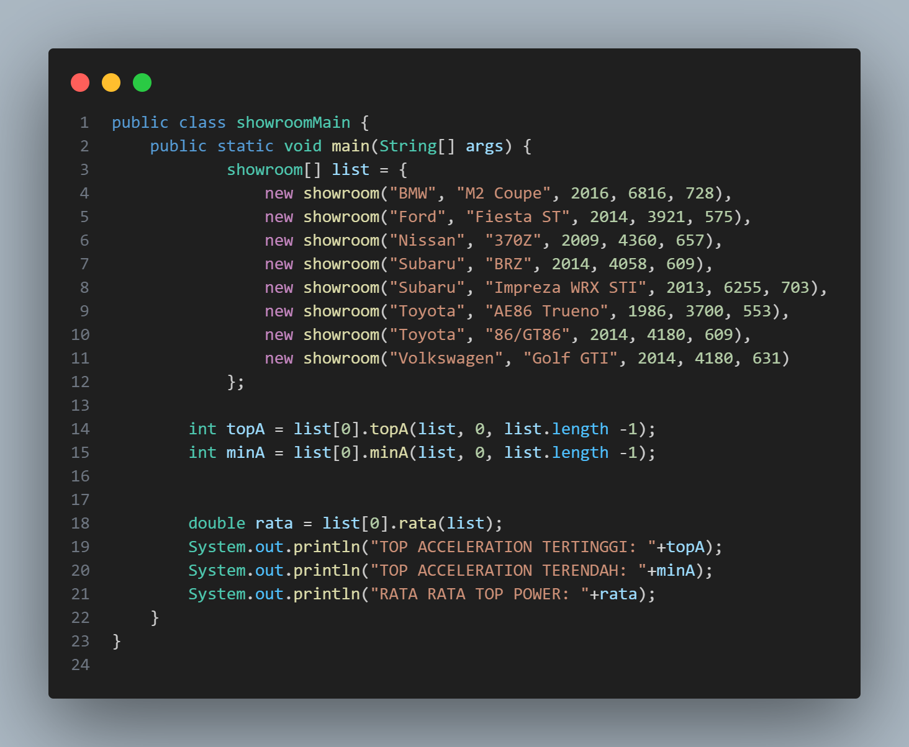
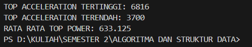

# 
  LAPORAN PRAKTIKUM ALGORITMA DAN STRUKTUR DATA 
 
# 
  JOBSHEET 4 
 
    

    

     

 Nama : Tiara Mera Sifa 

 NIM  : 2341720247 

 Prodi: D-IV Teknik Informatika

 Kelas: 1B / 27 

     

# Praktikum
## 4.2 Menghitung Nilai Faktorial dengan Algoritma Brute Force dan Divide and Conquer

## 4.2.2 Verifikasi Hasil Percobaan

## 4.2.3 Pertanyaan
1. Pada base line Algoritma Divide Conquer untuk melakukan pencarian nilai faktorial, jelaskan perbedaan bagian kode pada penggunaan if dan else! 
Perbedaanya terletak pada pemecahan masalahnya. If Else digunakan untuk mengevaluasi kondisi tertentu dan else digunakan ketika kondisi if tidak terpenuhi. Sedangkan Divide and Conquer membagi satu masalah menjadi sub masalah, dan kemudian sub masalah tersebut di pecahkan secara rekursif dan hasilnya digabung untuk mendapatkan solusi. 

2. Apakah memungkinkan perulangan pada method faktorialBF() dirubah selain menggunakan for?Buktikan! 
Memungkinkan.  

3. Jelaskan perbedaan antara fakto *= i; dan int fakto = n * faktorialDC(n-1); ! 
jadi fakto *= i, setiap iterasi loop langsung mengalikan nilai fakto dengan nilai i. Sedangkan int fakto = n * faktorialDC(n-1);, memanggil fungsi itu sendiri untuk menghitung nilai faktorial secara berulang sampai kasusnya terselesaikan.

## 4.3 Menghitung Hasil Pangkat dengan Algoritma Brute Force dan Divide and Conquer

## 4.2.2 Verifikasi Hasil Percobaan

## 4.2.3 Pertanyaan
1. Jelaskan mengenai perbedaan 2 method yang dibuat yaitu PangkatBF() dan PangkatDC()! 
pangkatBF() melakukan perhitungan berulang tanpa memecah masalahnya, sedangkan pangkatDC() membagi masalah menjadi submasalah yang lebih kecil untuk menghitung hasil pangkat.

2. Apakah tahap combine sudah termasuk dalam kode tersebut?Tunjukkan! 

3. Modifikasi kode program tersebut, anggap proses pengisian atribut dilakukan dengan konstruktor. 

4. Tambahkan menu agar salah satu method yang terpilih saja yang akan dijalankan menggunakan switch-case! 

## 4.4 Menghitung Sum Array dengan Algoritma Brute Force dan Divide and Conquer

## 4.2.2 Verifikasi Hasil Percobaan

## 4.2.3 Pertanyaan
1. Mengapa terdapat formulasi return value berikut?Jelaskan! 

Formulasi tersebut digunakan untuk menggabungkan total dari kedua submasalah kiri dan kanan dengan menambahkan nilai elemen tengah untuk mendapatkan total keseluruhan dari array.
2. Kenapa dibutuhkan variable mid pada method TotalDC()? 
Variable mid digunakan untuk menentukan pembagian array menjadi dua bagian yang seimbang.

3. Program perhitungan keuntungan suatu perusahaan ini hanya untuk satu perusahaan saja.
Bagaimana cara menghitung sekaligus keuntungan beberapa bulan untuk beberapa
perusahaan.(Setiap perusahaan bisa saja memiliki jumlah bulan berbeda-beda)? Buktikan
dengan program! 

## 4.5 Latihan Praktikum 

## HASIL
