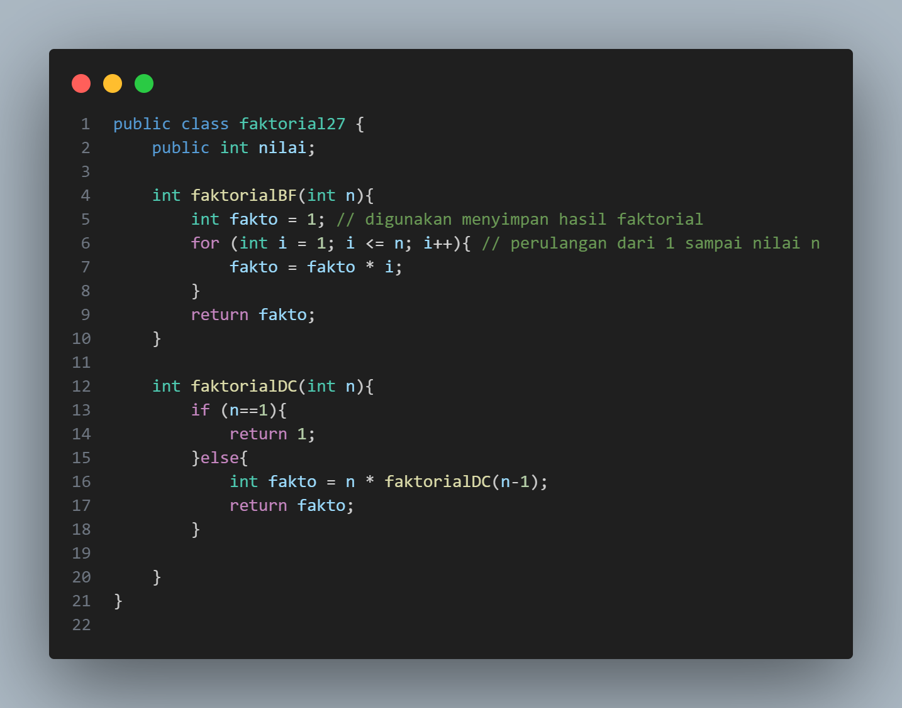
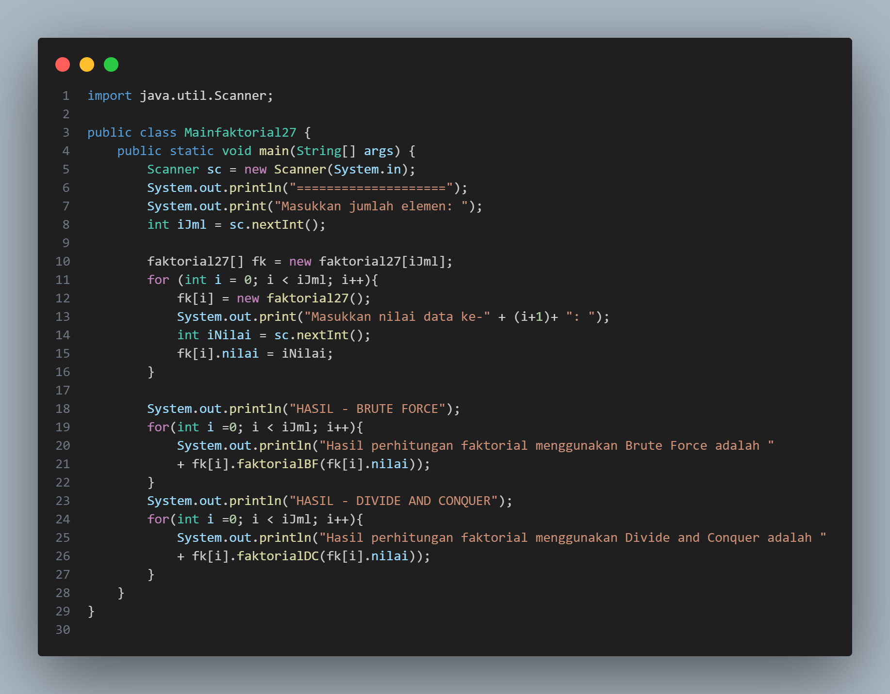
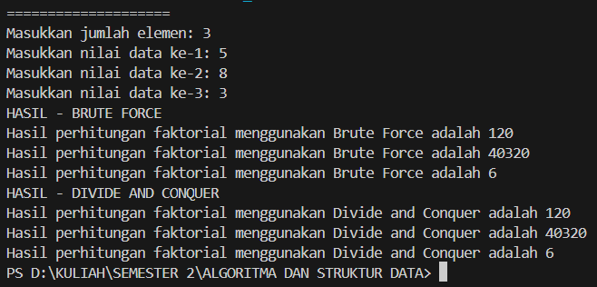
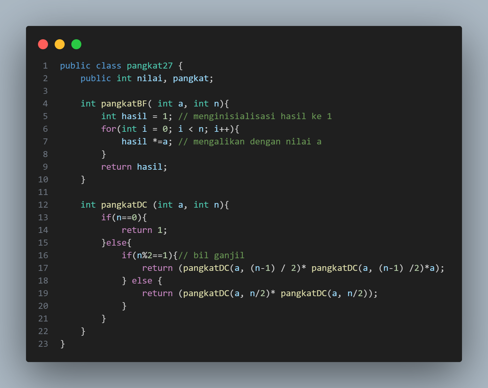
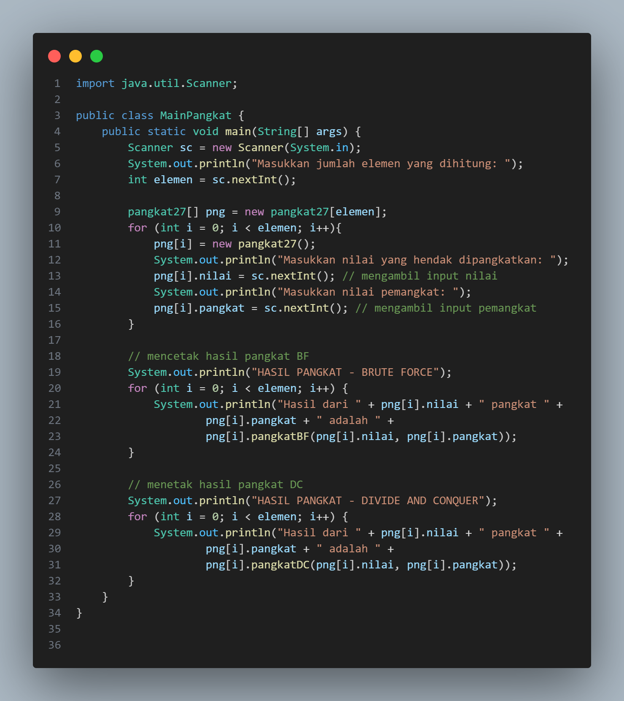
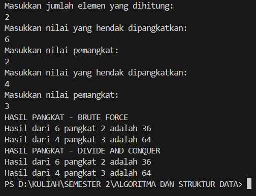
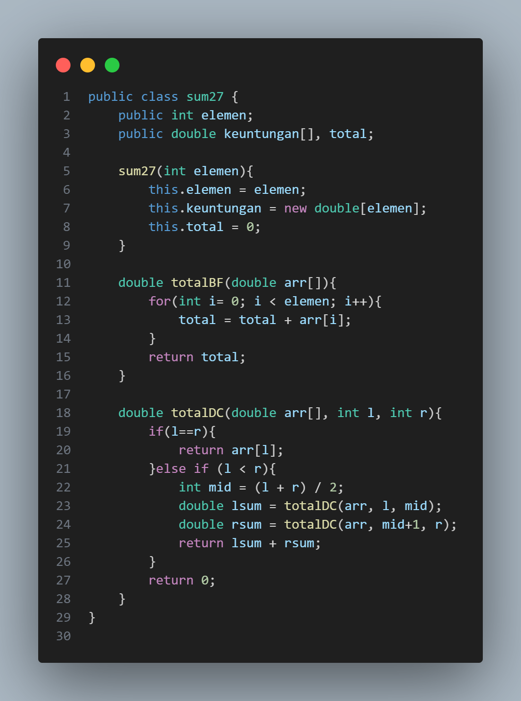
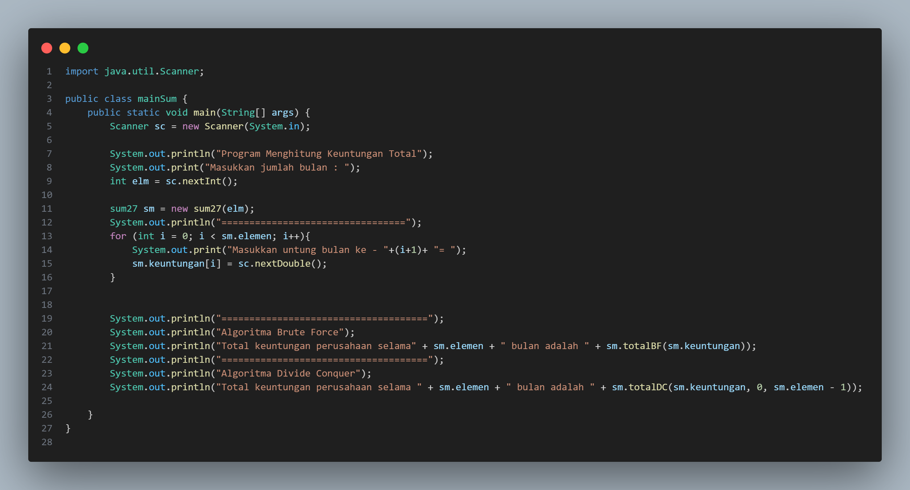
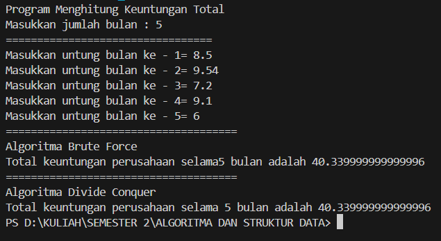
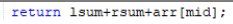

# 
  LAPORAN PRAKTIKUM ALGORITMA DAN STRUKTUR DATA 
 
# 
  JOBSHEET 4 
 
    

    

     

 Nama : Tiara Mera Sifa 

 NIM  : 2341720247 

 Prodi: D-IV Teknik Informatika

 Kelas: 1B / 27 

     

# Praktikum
## 4.2 Menghitung Nilai Faktorial dengan Algoritma Brute Force dan Divide and Conquer

## 4.2.2 Verifikasi Hasil Percobaan

## 4.2.3 Pertanyaan
1. Pada base line Algoritma Divide Conquer untuk melakukan pencarian nilai faktorial, jelaskan perbedaan bagian kode pada penggunaan if dan else! 

2. Apakah memungkinkan perulangan pada method faktorialBF() dirubah selain menggunakan for?Buktikan! 

3. Jelaskan perbedaan antara fakto *= i; dan int fakto = n * faktorialDC(n-1); ! 

## 4.3 Menghitung Hasil Pangkat dengan Algoritma Brute Force dan Divide and Conquer

## 4.2.2 Verifikasi Hasil Percobaan

## 4.2.3 Pertanyaan
1. Jelaskan mengenai perbedaan 2 method yang dibuat yaitu PangkatBF() dan PangkatDC()! 

2. Apakah tahap combine sudah termasuk dalam kode tersebut?Tunjukkan! 

3. Modifikasi kode program tersebut, anggap proses pengisian atribut dilakukan dengan konstruktor. 

4. Tambahkan menu agar salah satu method yang terpilih saja yang akan dijalankan menggunakan switch-case! 

## 4.4 Menghitung Sum Array dengan Algoritma Brute Force dan Divide and Conquer

## 4.2.2 Verifikasi Hasil Percobaan

## 4.2.3 Pertanyaan
1. Mengapa terdapat formulasi return value berikut?Jelaskan! 

2. Kenapa dibutuhkan variable mid pada method TotalDC()? 

3. Program perhitungan keuntungan suatu perusahaan ini hanya untuk satu perusahaan saja.
Bagaimana cara menghitung sekaligus keuntungan beberapa bulan untuk beberapa
perusahaan.(Setiap perusahaan bisa saja memiliki jumlah bulan berbeda-beda)? Buktikan
dengan program! 

## 4.5 Latihan Praktikum 
