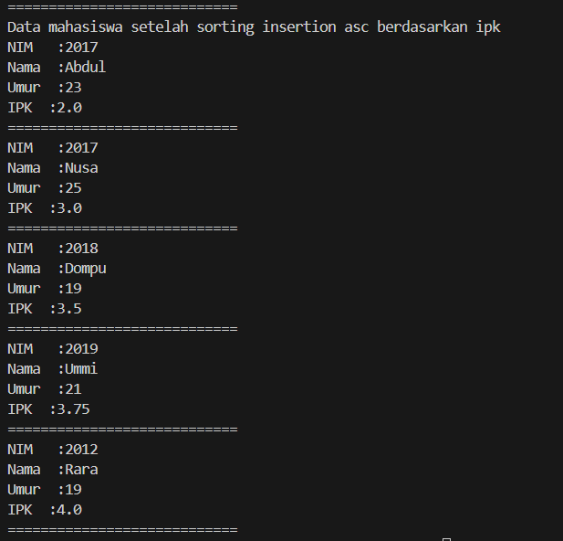

# 
  LAPORAN PRAKTIKUM ALGORITMA DAN STRUKTUR DATA 
 
# 
  JOBSHEET 5 
 
    

    

     

 Nama : Tiara Mera Sifa 

 NIM  : 2341720247 

 Prodi: D-IV Teknik Informatika

 Kelas: 1B / 27 

     

# Praktikum
## 5.2 Mengurutkan Data Mahasiswa Berdasarkan IPK Menggunakan Bubble Sort

      Class mahasiswa27
               public class mahasiswa27 {
                  int nim;
                  String nama;
                  int umur;
                  double ipk;

            public mahasiswa27( String ni, int n, int u, double i){
               nama = ni;
               nim = n;
               umur = u;
               ipk = i;
            }

            void tampil(){
               System.out.println("NIM   :"+ nim);
               System.out.println("Nama  :"+ nama);
               System.out.println("Umur  :"+ umur);
               System.out.println("IPK  :"+ ipk);
            }
         }

Class DaftarMhsPrestasi

         public class DaftarMhsPrestasi {
            mahasiswa27[] listMhs = new mahasiswa27[5];
            int idx;

            void tambah(mahasiswa27 m ){
               if (idx < listMhs.length){
                     listMhs[idx]  = m;
                     idx++;
               }else{
                     System.out.println("Data sudah penuh");
               }
            }

            void tampil(){
               for(mahasiswa27 m : listMhs){
                     m.tampil();
                     System.out.println("============================");
               }
            }

            void bubbleSort(){
               for (int i=0; i<listMhs.length-1; i++){
                     for (int j=1; j<listMhs.length-i; j++){
                        if(listMhs[j].ipk > listMhs [j-1].ipk){ // proses membandingkan
                           //proses swap
                           mahasiswa27 tmp = listMhs[j];
                           listMhs[j] = listMhs [j-1];
                           listMhs [j-1] = tmp;
                        }
                     }
               }
            }
         }
Class Mhs
         import java.util.Scanner;

         public class mainMhs {
            public static void main(String[] args) {
               DaftarMhsPrestasi list = new DaftarMhsPrestasi();
               mahasiswa27 m1 = new mahasiswa27("Nusa", 2017, 25, 3);
               mahasiswa27 m2 = new mahasiswa27("Rara", 2012, 19, 4);
               mahasiswa27 m3 = new mahasiswa27("Dompu", 2018, 19, 3.5);
               mahasiswa27 m4 = new mahasiswa27("Abdul", 2017, 23, 2);
               mahasiswa27 m5 = new mahasiswa27("Ummi", 2019, 21, 3.75);

               list.tambah(m1);
               list.tambah(m2);
               list.tambah(m3);
               list.tambah(m4);
               list.tambah(m5);

               System.out.println("Data mahasiswa sebelum sorting = ");
               list.tampil();

               System.out.println("Data mahasiswa setelah sorting desc berdasarkan ipk ");
               list.bubbleSort();
               list.tampil();

            }
         }

## 5.2.2 Verifikasi Hasil Percobaan

## 5.2.3 Pertanyaan
1. Terdapat di method apakah proses bubble sort?
2. Di dalam method bubbleSort(), terdapat baris program seperti di bawah ini:
Untuk apakah proses tersebut?
3. Perhatikan perulangan di dalam bubbleSort() di bawah ini:
a. Apakah perbedaan antara kegunaan perulangan i dan perulangan j?
b. Mengapa syarat dari perulangan i adalah i<listMhs.length-1 ?
c. Mengapa syarat dari perulangan j adalah j<listMhs.length-i ?
d. Jika banyak data di dalam listMhs adalah 50, maka berapakali perulangan i akan
berlangsung? Dan ada berapa Tahap bubble sort yang ditempuh?

## 5.2 Mengurutkan Data Mahasiswa Berdasarkan IPK Menggunakan Selection Sort
            void selectionSort(){
               for (int i=0; i<listMhs.length-1; i++){
                     int idxMin = i;
                     for (int j=i+1; j<listMhs.length; j++){
                        if(listMhs[j].ipk < listMhs [idxMin].ipk){ // proses membandingkan
                           idxMin = j;
                        }
                     }
                           //proses swap
                           mahasiswa27 tmp = listMhs[idxMin];
                           listMhs[idxMin] = listMhs [i];
                           listMhs [i] = tmp;
                        }
                     }      
            
Class main

                  System.out.println("Data mahasiswa setelah sorting asc berdasarkan ipk");
                  list.selectionSort();
                  list.tampil();

## 5.2.2 Verifikasi Hasil Percobaan

## 5.2.3 Pertanyaan
Di dalam method selection sort, terdapat baris program seperti di bawah ini:
Untuk apakah proses tersebut, jelaskan!

## 5.2 Mengurutkan Data Mahasiswa Berdasarkan IPK Menggunakan  Insertion Sort
Class DaftarMhsPrestasi

            void insertionSort(){
               for (int i=1; i<listMhs.length; i++){
                     mahasiswa27 temp = listMhs[i];
                     int j = i;
                     while ( j < 0 && listMhs[j-1].ipk > temp.ipk) {
                        listMhs[j] = listMhs[ j-1 ];
                        j--;
                     }
                     listMhs[j] = temp;
                     }
            }

class Main

         System.out.println("Data mahasiswa setelah sorting insertion asc berdasarkan ipk");
               list.selectionSort();
               list.tampil();

## 5.2.2 Verifikasi Hasil Percobaan

## 5.2.3 Pertanyaan
Ubahlah fungsi pada InsertionSort sehingga fungsi ini dapat melaksanakan proses sorting
dengan cara descending.

## 5.5 Latihan Praktikum
### class hotel

            public class hotel {
               String nama;
               String kota;
               int harga;
               Byte bintang;

            hotel (String n, String k, int h, Byte b){
               nama = n;
               kota = k;
               harga = h;
               bintang = b;
            }

            void tampilAll(){
               System.out.println("NAMA HOTEL: " + nama);
               System.out.println("KOTA      : " + kota);
               System.out.println("HARGA     : " + harga);
               System.out.println("BINTANG   : " + bintang);

            }
         }

### class hotelService

                  public class hotelService {
                     hotel[] listHotel = new hotel[6];
                     int idx;

               void tambah(hotel h ){
                  if (idx < listHotel.length){
                        listHotel[idx]  = h;
                        idx++;
                  }else{
                        System.out.println("Data sudah penuh");
                  }
               }

               void tampilAll(){
                  for(hotel h : listHotel){
                        h.tampilAll();
                        System.out.println("============================");
                  }
               }

               void bubbleSortHarga(){
                  for (int i=0; i<listHotel.length-1; i++){
                        for (int j=1; j<listHotel.length-i; j++){
                           if(listHotel[j].harga > listHotel [j-1].harga){ // proses membandingkan
                              //proses swap
                              hotel tmp = listHotel[j];
                              listHotel[j] = listHotel [j-1];
                              listHotel[j-1] = tmp;
                           }
                        }
                  }
               }

               void selectionSortBintang(){
                  for (int i=0; i<listHotel.length-1; i++){
                        int idxMin = i;
                        for (int j=i+1; j<listHotel.length; j++){
                           if(listHotel[j].bintang < listHotel [idxMin].bintang){ // proses membandingkan
                              idxMin = j;
                           }
                        }
                              //proses swap
                              hotel tmp = listHotel[idxMin];
                              listHotel[idxMin] = listHotel [i];
                              listHotel[i] = tmp;
                           }
               }

            }

### class mainHotel

         public class mainHotel {
            public static void main(String[] args) {
               hotelService listHotel = new hotelService();
               hotel h1 = new hotel("Grand Mecure", "Malang", 900000,(byte)4);
               hotel h2 = new hotel("Aston", "Surabaya", 850000,(byte)5);
               hotel h3 = new hotel("Grand Malioboro", "Yogyakarta", 1000000,(byte)6);
               hotel h4 = new hotel("Savana", "Malang", 700000,(byte)3);
               hotel h5 = new hotel("101", "Malang", 600000,(byte)2);
               hotel h6 = new hotel("Ibis", "Malang", 400000,(byte)1);

               listHotel.tambah(h1);
               listHotel.tambah(h2);
               listHotel.tambah(h3);
               listHotel.tambah(h4);
               listHotel.tambah(h5);
               listHotel.tambah(h6);

               System.out.println("----------------------------");
               System.out.println("DATA HOTEL");
               System.out.println("----------------------------");
               listHotel.tampilAll();

               System.out.println("----------------------------");
               System.out.println("BERDASARKAN HARGA");
               System.out.println("----------------------------");
               listHotel.bubbleSortHarga();
               listHotel.tampilAll();

               System.out.println("----------------------------");
               System.out.println("BERDASARKAN BINTANG ");
               System.out.println("----------------------------");
               listHotel.selectionSortBintang();
               listHotel.tampilAll();

            }
         }

### Hasil

