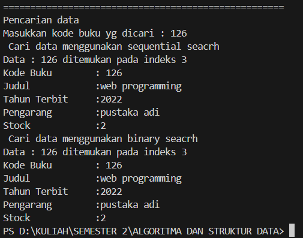
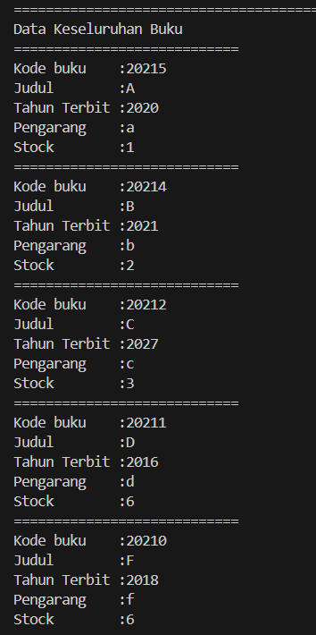

# 
  LAPORAN PRAKTIKUM ALGORITMA DAN STRUKTUR DATA 
 
# 
  JOBSHEET 6 
 
    

    

     

 Nama : Tiara Mera Sifa 

 NIM  : 2341720247 

 Prodi: D-IV Teknik Informatika

 Kelas: 1B / 27 

     

# Praktikum
### 6.2. Searching / Pencarian Menggunakan Agoritma Sequential Search
### class buku27

      public class buku27 {
         int kodeBuku, tahunTerbit, stock;
         String judul, pengarang;

         public buku27(int kodeBuku, String judul, int tahunTerbit, String pengarang, int stock){
            this.kodeBuku =kodeBuku;
            this.judul = judul;
            this.tahunTerbit = tahunTerbit;
            this.pengarang = pengarang;
            this.stock = stock; 
         }

         void TampilDataBuku(){
            System.out.println("============================");
            System.out.println("Kode buku    :" + kodeBuku);
            System.out.println("Judul        :" + judul);
            System.out.println("Tahun Terbit :" + tahunTerbit);
            System.out.println("Pengarang    :" + pengarang);
            System.out.println("Stock        :" + stock);
         }

      }

### class bukuMain27

         import java.util.Scanner;

         public class bukuMain27 {
            public static void main(String[] args) {
               Scanner s = new Scanner(System.in);
               Scanner s1 = new Scanner(System.in);

               pencarianBuku data = new pencarianBuku();
               int jumlah = 5;

               System.out.println("==================================================");
               System.out.println("Masukkan data buku urut dari kode buku terkecil: ");
               for(int i =0; i < jumlah; i++){
                     System.out.println("==================================================");
                     System.out.print("Kode Buku    \t: ");
                     int kodeBuku = s.nextInt();
                     System.out.print("Judul Buku   \t: ");
                     String judul = s1.nextLine();
                     System.out.print("Tahun Terbit \t: ");
                     int tahunTerbit = s.nextInt();
                     System.out.print("Pengarang   \t: ");
                     String pengarang = s1.nextLine();
                     System.out.print("Stock   \t: ");
                     int stock = s.nextInt();

                     buku27 m = new buku27(kodeBuku, judul, tahunTerbit, pengarang, stock);
                     data.tambah(m);
               };
               System.out.println("====================================================");
               System.out.println("Data Keseluruhan Buku");
               data.tampil();

               System.out.println("====================================================");
               System.out.println("Pencarian data");
               System.out.print("Masukkan kode buku yg dicari : ");
               int cari = s.nextInt();
               System.out.println(" Cari data menggunakan sequential seacrh");
               int posisi = data.findSeqSearch(cari);
               data.TampilPosisi(cari, posisi);
               data.TampilData(cari, posisi);

            }
            
         }

### class pencarianBuku

         public class pencarianBuku {
            buku27[] listBuku = new buku27[5];
            int idx;

            void tambah(buku27 m){
               if (idx < listBuku.length) {
                     listBuku[idx] = m;
                     idx++;     
               } else {
                     System.out.println("Data sudah penuh!");
               }
            }

            void tampil(){
               for(buku27 m : listBuku) {
                     m.TampilDataBuku();
               }
            }

            public int findSeqSearch (int cari){
               int posisi = -1;
               for (int j =0; j <listBuku.length; j++){
                     if(listBuku[j].kodeBuku == cari){
                        posisi = j;
                        break;
                     }
               }
               return posisi;
            }

            public void TampilPosisi(int x, int pos){
               if (pos!= -1){
                     System.out.println("Data : " + x +" ditemukan pada indeks "+ pos);
               }else {
                     System.out.println("Data " + x + "tidak ditemukan");
               }
            }

            public void TampilData(int x, int pos){
               if (pos!= -1) {
                     System.out.println("Kode Buku\t : " + x);
                     System.out.println("Judul\t\t :" +listBuku[pos].judul);
                     System.out.println("Tahun Terbit\t :" +listBuku[pos].tahunTerbit);
                     System.out.println("Pengarang\t :" +listBuku[pos].pengarang);
                     System.out.println("Stock\t\t :" +listBuku[pos].stock);
               }else {
                     System.out.println("Data " + x + "tidak ditemukan");
               }
            }

         }

### 6.2.2. Verifikasi Hasil Percobaan

### jika data ditemukan

### jika data tidak ditemukan

### 6.2.3. Pertanyaan
1. Jelaskan fungsi break yang ada pada method FindSeqSearch! 
break tersebut memberhentikan perulangan for, karena elemen yang dicari sudah ditemukan. Sehingga tidak perlu melanjutkan iterasi selanjutnya.
2. Jika Data Kode Buku yang dimasukkan tidak terurut dari kecil ke besar. Apakah program masih
dapat berjalan? Apakah hasil yang dikeluarkan benar? Tunjukkan hasil screenshoot untuk bukti
dengan kode Buku yang acak. Jelaskan Mengapa hal tersebut bisa terjadi?  
Iya program masih dapat berjalan, dan program yang dikeluarkan benar. Hal ini terjadi karena program hanya mencari indeks buku, jadi tidak perlu urut

3. Buat method baru dengan nama FindBuku menggunakan konsep sequential search dengan tipe
method dari FindBuku adalah BukuNoAbsen. Sehingga Anda bisa memanggil method
tersebut pada class BukuMain seperti gambar berikut :
### class pencarianBuku

      public buku27 findBuku(int cari){
            int posisi = -1;
            for (int j =0; j <listBuku.length; j++){
                  if(listBuku[j].kodeBuku == cari){
                     posisi = j;
                     break;
                  }
            }
            return listBuku[posisi];
         }

### class main

      buku27 dataBuku27 = data.findBuku(cari);
            dataBuku27.TampilDataBuku();

### hasil

### 6.3. Searching / Pencarian Menggunakan Binary Search

### class pencarianBuku

         public int findBinarySearch(int cari, int left, int right) {
               int mid;
               if (right >= left) {
                     mid = left + (right - left) / 2;
                     if (cari == listBuku[mid].kodeBuku) {
                        return mid;
                     } else if (listBuku[mid].kodeBuku > cari) {
                        return findBinarySearch(cari, left, mid);
                     } else {
                        return findBinarySearch(cari, mid, right);
                     }
               }
               return -1;
            }

### class bukuMain27

         System.out.println(" Cari data menggunakan binary seacrh");
               posisi = data.findBinarySearch(cari, 0, jumlah - 1);
               data.TampilPosisi(cari, posisi);
               data.TampilData(cari, posisi);

### 6.3.2. Verifikasi Hasil Percobaan

### 6.3.3. Pertanyaan
1. Tunjukkan pada kode program yang mana proses divide dijalankan! 

         mid = left + (right - left) / 2;

mid sebagai titik tengah dari pencarian antara left dan right
2. Tunjukkan pada kode program yang mana proses conquer dijalankan! 

         if (cari == listBuku[mid].kodeBuku) {
            return mid; // Elemen ditemukan
         } else if (listBuku[mid].kodeBuku > cari) {
            return findBinarySearch(cari, left, mid - 1); // Cari di sebelah kiri
         } else {
            return findBinarySearch(cari, mid + 1, right); // Cari di sebelah kanan
         }

Proses conquer dijalankan ketika kita memilih bagian mana yang akan dicari selanjutnya, berdasarkan dari hasil sebelumnya.

4. Jika data Kode Buku yang dimasukkan tidak urut. Apakah program masih dapat berjalan? Mengapa
demikian! Tunjukkan hasil screenshoot untuk bukti dengan kode Buku yang acak. Jelaskan
Mengapa hal tersebut bisa terjadi? 

Program tetap berjalan, tapi hasil pencarian tidak dapat ditemukan, karena data yang dimasukkan tidak terurut.
3. Jika Kode Buku yang dimasukkan dari Kode Buku terbesar ke terkecil (missal : 20215, 20214,
20212, 20211, 20210) dan elemen yang dicari adalah 20210. Bagaimana hasil dari binary search?
Apakah sesuai? Jika tidak sesuai maka ubahlah kode program binary seach agar hasilnya sesuai! 
Jika yang dimasukkan dari kode buku terbesar ke  terkecil maka hasil pencariannya tidak akan sesuai. Dikarenakan program dari terkecil ke terbesar, sehingga proses perbandingannya harus diubah.

         public int findBinarySearch(int cari, int left, int right) {
               int mid;
               if (right >= left) {
                     mid = left + (right - left) / 2;
                     if (cari == listBuku[mid].kodeBuku) {
                        return mid;
                     } else if (listBuku[mid].kodeBuku < cari) { // mengubah tanda perbandingan yg awalnya > menjadi <
                        return findBinarySearch(cari, left, mid -1);
                     } else {
                        return findBinarySearch(cari, mid + 1, right);
                     }
               }
               return -1;
            }

output

### 6.4. Percobaan Pengayaan Divide and Conquer / Merge Sort

### class mergeSort27

         public class mergeSort27 {

            public void mergeSort27(int[] data){

            }

            public void merge(int[] data, int left, int middle, int right){
               int[] temp = new int[data.length];
               for (int i = left; i <= right; i++){
                     temp[i] = data[i];
               }
               int a = left;
               int b = middle + 1;
               int c = left;

               while (a <= middle && b <= right) {
                     if (temp[a] <= temp[b]) {
                        data [c] = temp [a];
                        a++;
                     } else {
                        data[c] = temp[b];
                        b++;
                     }
                     c++;
               }
               int s = middle - a + 1;
               for (int i = 0; i <= s; i++){
                     data[c + i]= temp[a + i];
               }
            }

            public void sort(int data[], int left, int right){
               if (left < right) {
                     int middle = (left + right) / 2;
                     sort(data, left, middle);
                     sort(data, middle + 1, right);
                     merge(data, left, middle, right);
               }
            }

            public void printArray(int arr[]){
               for (int i = 0; i < arr.length; i++){
                     System.out.println(arr[i] + "");
               }
               System.out.println();
            }

         }

### class mergeSort27Main

         public class mergeSort27Main {
            public static void main(String[] args) {
               int data[] ={10,40,30,50,70,20,100,90};
               System.out.println("Sorting dgn merge sort");
               mergeSort27 mSort = new mergeSort27();
               System.out.println("Data awal");
               mSort.printArray(data);
               mSort.sort(data, 0, data.length - 1); 

               System.out.println("setelah diurutkan");
               mSort.printArray(data);
            }
         }

### 6.4.2. Verifikasi Hasil Percobaan

### 6.5. Latihan Praktikum

1. Modifikasi percobaan searching diatas dengan ketentuan berikut ini
- Ubah tipe data dari kode Buku yang awalnya int menjadi String

         public class buku27 {
            int tahunTerbit, stock;
            String kodeBuku, judul, pengarang;

            public buku27(String kodeBuku, String judul, int tahunTerbit, String pengarang, int stock){
               this.kodeBuku =kodeBuku;
               this.judul = judul;
               this.tahunTerbit = tahunTerbit;
               this.pengarang = pengarang;
               this.stock = stock; 
            }

            void TampilDataBuku(){
               System.out.println("============================");
               System.out.println("Kode buku    :" + kodeBuku);
               System.out.println("Judul        :" + judul);
               System.out.println("Tahun Terbit :" + tahunTerbit);
               System.out.println("Pengarang    :" + pengarang);
               System.out.println("Stock        :" + stock);
            }

         }

- Tambahkan method untuk pencarian kode Buku (bertipe data String) dengan menggunakan sequential search dan binary search.

2. Modifikasi percobaan searching diatas dengan ketentuan berikut ini
- Tambahkan method pencarian judul buku menggunakan sequential search dan binary 
search. Sebelum dilakukan searching dengan binary search data harus dilakukan pengurutan 
dengan menggunakan algoritma Sorting (bebas pilih algoritma sorting apapun)! Sehingga 
ketika input data acak, maka algoritma searching akan tetap berjalan
- Buat aturan untuk mendeteksi hasil pencarian judul buku yang lebih dari 1 hasil dalam 
bentuk kalimat peringatan! Pastikan algoritma yang diterapkan sesuai dengan kasus yang 
diberikan