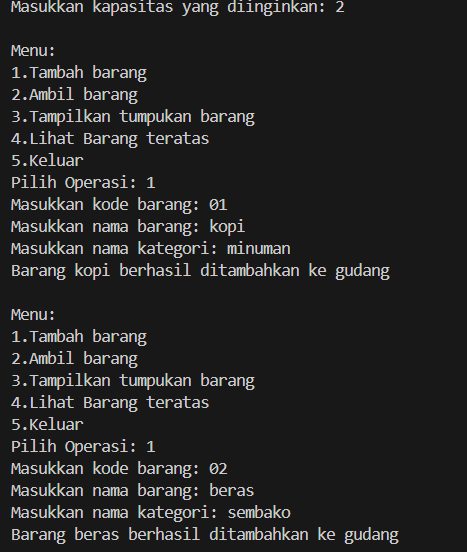
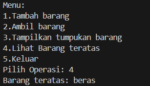
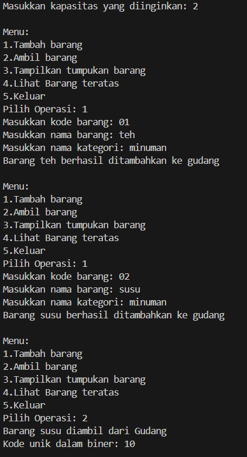
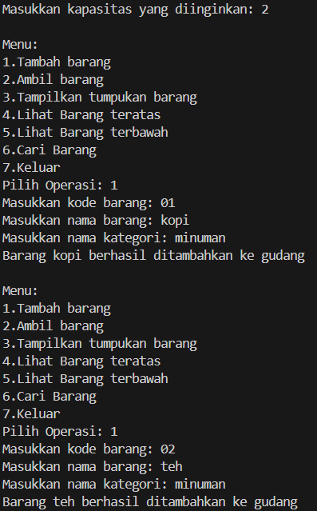
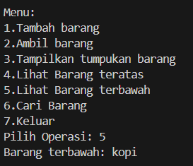
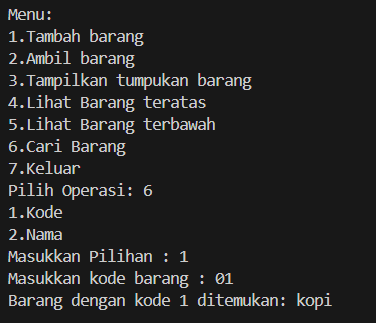

# 
  LAPORAN PRAKTIKUM ALGORITMA DAN STRUKTUR DATA 
 
# 
  JOBSHEET 7 
 
    

    

     

 Nama : Tiara Mera Sifa 

 NIM  : 2341720247 

 Prodi: D-IV Teknik Informatika

 Kelas: 1B / 27 

     

# Praktikum

## 2.1 Percobaan 1: Penyimpanan Tumpukan Barang dalam Gudang

###  class Barang27

         public class Barang27 {
            int kode;
            String nama, kategori;

            Barang27(int kode, String nama, String kategori){
               this.kode = kode;
               this.nama = nama;
               this.kategori = kategori;
            }
         }

###  class Gudang27

         public class Gudang27 {
            Barang27[] tumpukan;
            int size, top;

            Gudang27 (int kapasitas){
               size = kapasitas;
               tumpukan = new Barang27[size];
               top = -1;
            }

            public boolean cekKosong(){// mengecek apakah tumpukan barang masih kosong
               if (top== -1) {
                     return true;
               } else {
                     return false;
               }
            }

            public boolean cekPenuh(){ // mengecek apakah tumpukan barang sdh penuh
               if (top == size -1) {
                     return true;
               } else {
                     return false;
               }
            }

            public void tambahBarang(Barang27 brg){
               if (!cekPenuh()) {
                     top++;
                     tumpukan[top] = brg;
                     System.out.println("Barang " + brg.nama + " berhasil ditambahkan ke gudang");
               } else {
                     System.out.println("Gagal!! Tumpukan barang di gudang sudah penuh");
               }
            }

            public Barang27 ambilBarang(){
               if (!cekKosong()) {
                     Barang27 delete = tumpukan[top];
                     top--;
                     System.out.println("Barang " + delete.nama + " diambil dari Gudang");
                     return delete;
               } else {
                     System.out.println("Tumpukan barang kosong");
                     return null;
               }
            }

            public Barang27 lihatBarangTeratas(){
               if (!cekKosong()) {
                     Barang27 barangTeratas = tumpukan[top];
                     System.out.println("Barang teratas: " + barangTeratas.nama);
                     return barangTeratas;
               } else {
                     System.out.println("Tumpukan barang kosong");
                     return null;
               }
            }

            public void tampilBarang(){
               if (!cekKosong()) {
                     System.out.println("Rincian tumpukan barang di Gudang: ");
                     for (int i = top; i >= top; i--) {
                        System.out.printf("Kode %d: %s (Kategori %s)\n", tumpukan[i].kode, tumpukan[i].nama, tumpukan[i].kategori);
                     }
               } else {
                     System.out.println("Tumpukan barang kosong");
               }
            }
         }

###  class Utama27

         import java.util.Scanner;

         public class Utama27 {
            public static void main(String[] args) {
               Gudang27 gudang = new Gudang27(7);
               Scanner scanner = new Scanner(System.in);

               while(true){
                     System.out.println("\nMenu:");
                     System.out.println("1.Tambah barang");
                     System.out.println("2.Ambil barang");
                     System.out.println("3.Tampilkan tumpukan barang");
                     System.out.println("4.Keluar");
                     System.out.print("Pilih Operasi: ");
                     int pilihan = scanner.nextInt();
                     scanner.nextLine();

                     switch (pilihan) {
                        case 1:
                           System.out.print("Masukkan kode barang: ");
                           int kode = scanner.nextInt();
                           scanner.nextLine();
                           System.out.print("Masukkan nama barang: ");
                           String nama = scanner.nextLine();
                           System.out.print("Masukkan nama kategori: ");
                           String kategori = scanner.nextLine();
                           Barang27 barangBaru = new Barang27(kode, nama, kategori);
                           gudang.tambahBarang(barangBaru);
                           break;
                        case 2:
                           gudang.ambilBarang();
                           break;
                        case 3:
                           gudang.tampilBarang();
                           break;
                        case 4:
                           break;
                        default:
                           System.out.println("Pilihan tidak valid. Silahkan coba lagi.");;
                     }

               }
            }
         }

## 2.1.2 Verifikasi Hasil Percobaan

## 2.1.3 Pertanyaan
1. Lakukan perbaikan pada kode program, sehingga keluaran yang dihasilkan sama dengan verifikasi
hasil percobaan! Bagian mana saja yang perlu diperbaiki? 
Kode program sudah diperbaiki sehingga sudah sesuai dengan output. Bagian kode yang perlu diperbaiki berada di method tampilkanBarang, karena rincian tumpukan barang terbalik, sehingga kode diperbaiki sebagai berikut  

         public void tampilBarang(){
               if (!cekKosong()) {
                     System.out.println("Rincian tumpukan barang di Gudang: ");
                     for (int i = top; i >= 0; i--) {
                        System.out.printf("Kode %d: %s (Kategori %s)\n", tumpukan[i].kode, tumpukan[i].nama, tumpukan[i].kategori);
                     }
               } else {
                     System.out.println("Tumpukan barang kosong");
               }
            }

2. Berapa banyak data barang yang dapat ditampung di dalam tumpukan? Tunjukkan potongan kode
programnya!
Data yang dapat ditampung sebanyak 7. Kode programnnya sebagai berikut  

         public static void main(String[] args) {
               Gudang27 gudang = new Gudang27(7);

3. Mengapa perlu pengecekan kondisi !cekKosong() pada method tampilkanBarang? Kalau kondisi
tersebut dihapus, apa dampaknya?  
Pengecekan kondisi cekkosong diperlukan untuk memastikan bahwa program akan berjalan jika tumpukan tidak kosong.

4. Modifikasi kode program pada class Utama sehingga pengguna juga dapat memilih operasi lihat
barang teratas, serta dapat secara bebas menentukan kapasitas gudang!

### class utama (bebas menentukan kapasitas gudang)

            public static void main(String[] args) {
               // Gudang27 gudang = new Gudang27(7);
               Scanner scanner = new Scanner(System.in);

               System.out.print("Masukkan kapasitas yang diinginkan: ");
               int kapasitas = scanner.nextInt();

               Gudang27 gudang = new Gudang27(kapasitas);

### class utama (lihat barang teratas)

         while(true){
                     System.out.println("\nMenu:");
                     System.out.println("1.Tambah barang");
                     System.out.println("2.Ambil barang");
                     System.out.println("3.Tampilkan tumpukan barang");
                     System.out.println("4.Lihat Barang teratas ");
                     System.out.println("5.Keluar");
                     System.out.print("Pilih Operasi: ");
                     int pilihan = scanner.nextInt();
                     scanner.nextLine();

                     switch (pilihan) {
                        case 1:
                           System.out.print("Masukkan kode barang: ");
                           int kode = scanner.nextInt();
                           scanner.nextLine();
                           System.out.print("Masukkan nama barang: ");
                           String nama = scanner.nextLine();
                           System.out.print("Masukkan nama kategori: ");
                           String kategori = scanner.nextLine();
                           Barang27 barangBaru = new Barang27(kode, nama, kategori);
                           gudang.tambahBarang(barangBaru);
                           break;
                        case 2:
                           gudang.ambilBarang();
                           break;
                        case 3:
                           gudang.tampilBarang();
                           break;
                        case 4:
                        gudang.lihatBarangTeratas();
                           break;
                        case 5:
                        break;
                        default:
                           System.out.println("Pilihan tidak valid. Silahkan coba lagi.");;
                     }

               }

### hasil

5. Commit dan push kode program ke Github

## 2.2 Percobaan 2: Konversi Kode Barang ke Biner 
### class stackKonversi27

         public class StackKonversi27 {
            int size, top;
            int[] tumpukanBiner;

            public StackKonversi27() {
               this.size = 32; // asumsi 32 bit
               tumpukanBiner = new int[size];
               top = -1;
            }

            public boolean isEmpty(){
               return top == -1;
            }

            public boolean isFull(){
               return top == size;
            }

            public void push(int data) {
               if (isFull()) {
                     System.out.println("Stack Penuh!!");
               } else {
                     top++;
                     tumpukanBiner[top] = data;
               }
            }

            public int pop(){
               if (isEmpty()) {
                     System.out.println("Stack Kosong");
                     return -1;
               } else {
                     int data = tumpukanBiner[top];
                     top--;
                     return data;
               }
            }
         }

### class gudang27

         public String konversiDesimalkeBiner(int kode) {
               StackKonversi27 stack = new StackKonversi27();
               while (kode >0) {
                     int sisa = kode % 2;
                     stack.push(sisa);
                     kode = kode / 2;
               }
               String biner = new String();
               while (!stack.isEmpty()) {
                     biner += stack.pop();
               }
               return biner;
            }

## 2.2.2Verifikasi Hasil Percobaan

## 2.2.3 Pertanyaan
1. Pada method konversiDesimalKeBiner, ubah kondisi perulangan menjadi while (kode != 0),
bagaimana hasilnya? Jelaskan alasannya! 
Hasilnya akan berubah, karena perulangan akan lanjut meskipun ketika nilai negatif 
2. Jelaskan alur kerja dari method konversiDesimalKeBiner! 
Jadi diawali dengan while (kode > 0), jadi jika kode lebih dari 0 maka program dapat berjalan dan melakukan pembagian. lalu kode kita modulus dengan 2. dan jika memiliki sisa maka akan disimpan di stack.push(sisa). Lalu untuk string binner merupaka n tempat kita menyimpan angka biner yang dihasilkan. Untuk while(!stack.isEmpty()), jadi jika kotak masih berisi bilangan maka program dapat berjalan. Lalu untuk biner += stack.pop(); ini berarti kita mengambil angka paling atas lalu menuliskannya ditempat kosong tadi, dan kita lakukan sampai kotak kosong. Dan return merupakan hasil binner.

## 2.3 Percobaan 3: Konversi Notasi Infix ke Postfix
### class postfix27.java

         public class Postfix27 {
            int n, top;
            char[] stack;

            public Postfix27(int total){
               n = total;
               top = -1;
               stack = new char[n];
               push('(');
            }

            public void push(char c){
               top++;
               stack[top] = c;
            }

            public char pop(){
               char item = stack[top];
               top--;
               return item;
            }

            public boolean isOperand(char c){
               if ((c >='A' && c <= 'Z') || (c >='a' && c <= 'z') ||
                     (c >='0' && c <= '9') || (c >=' ' && c <= '.') ) {
                        return true;
                     } else {
                        return false;
                     }
            }

            public boolean isOperator(char c){
               if (c == '^' || c == '%' || c == '/' || c == '*' || c == '-' || c == '+' ) {
                     return true;
               } else {
                     return false;
               }
            }

            public int derajat(char c){
               switch (c) {
                     case '^':
                        return 3;
                     case '%':
                        return 2;
                     case '/':
                        return 2;
                     case '*':
                        return 2;
                     case '-':
                        return 1;
                     case '+':
                        return 1;
                     default:
                        return 0;

               }
            }

            public String konversi(String Q) {
               String P ="";
               char c;
               for (int i = 0; i < n; i++){
                     c = Q.charAt(i);
                     if (isOperand(c)) {
                        P = P + c;
                     }
                     if (c == '(') {
                        push(c);
                     }
                     if (c ==')') {
                        while (stack[top] != '(') {
                           P = P + pop ();
                        }
                        pop();
                     }
                     if (isOperator(c)) {
                        while (derajat(stack[top]) >= derajat(c)) {
                           P = P + pop();
                        }
                        push (c);
                     }
               }
               return P;
            }
         }

### class postfixMain

         import java.util.Scanner;
         public class PostfixMain {
            public static void main(String[] args) {
               Scanner sc = new Scanner(System.in);
               String P, Q;
               System.out.print("Masukkan ekspresi matematika(infix): ");
               Q = sc.nextLine();
               Q = Q.trim();
               Q = Q + ")";
               int total = Q.length();

               Postfix27 post = new Postfix27(total);
               P = post.konversi(Q);
               System.out.println("Postfix: " + P);
            }
         }

## 2.3.2 Verifikasi Hasil Percobaan

## Latihan Praktikum

terbawah

cari kode

cari nama
