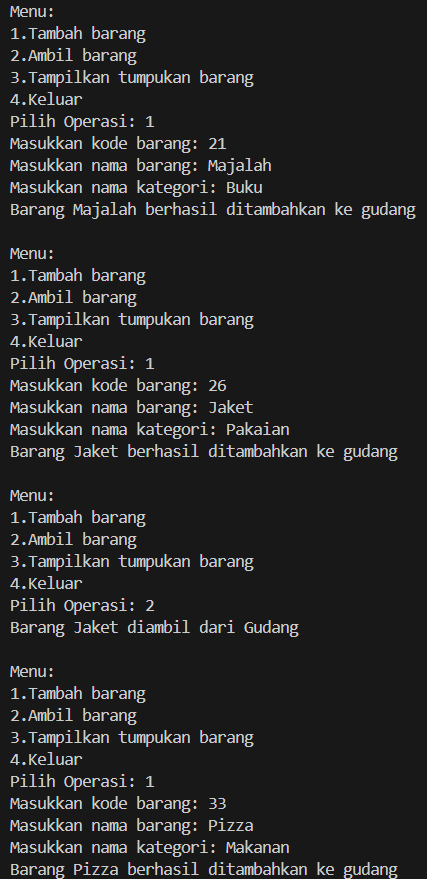
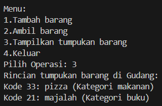

# 
  LAPORAN PRAKTIKUM ALGORITMA DAN STRUKTUR DATA 
 
# 
  JOBSHEET 7 
 
    

    

     

 Nama : Tiara Mera Sifa 

 NIM  : 2341720247 

 Prodi: D-IV Teknik Informatika

 Kelas: 1B / 27 

     

# Praktikum

## 2.1 Percobaan 1: Penyimpanan Tumpukan Barang dalam Gudang

###  class Barang27

         public class Barang27 {
            int kode;
            String nama, kategori;

            Barang27(int kode, String nama, String kategori){
               this.kode = kode;
               this.nama = nama;
               this.kategori = kategori;
            }
         }

###  class Gudang27

         public class Gudang27 {
            Barang27[] tumpukan;
            int size, top;

            Gudang27 (int kapasitas){
               size = kapasitas;
               tumpukan = new Barang27[size];
               top = -1;
            }

            public boolean cekKosong(){// mengecek apakah tumpukan barang masih kosong
               if (top== -1) {
                     return true;
               } else {
                     return false;
               }
            }

            public boolean cekPenuh(){ // mengecek apakah tumpukan barang sdh penuh
               if (top == size -1) {
                     return true;
               } else {
                     return false;
               }
            }

            public void tambahBarang(Barang27 brg){
               if (!cekPenuh()) {
                     top++;
                     tumpukan[top] = brg;
                     System.out.println("Barang " + brg.nama + " berhasil ditambahkan ke gudang");
               } else {
                     System.out.println("Gagal!! Tumpukan barang di gudang sudah penuh");
               }
            }

            public Barang27 ambilBarang(){
               if (!cekKosong()) {
                     Barang27 delete = tumpukan[top];
                     top--;
                     System.out.println("Barang " + delete.nama + " diambil dari Gudang");
                     return delete;
               } else {
                     System.out.println("Tumpukan barang kosong");
                     return null;
               }
            }

            public Barang27 lihatBarangTeratas(){
               if (!cekKosong()) {
                     Barang27 barangTeratas = tumpukan[top];
                     System.out.println("Barang teratas: " + barangTeratas.nama);
                     return barangTeratas;
               } else {
                     System.out.println("Tumpukan barang kosong");
                     return null;
               }
            }

            public void tampilBarang(){
               if (!cekKosong()) {
                     System.out.println("Rincian tumpukan barang di Gudang: ");
                     for (int i = top; i >= top; i--) {
                        System.out.printf("Kode %d: %s (Kategori %s)\n", tumpukan[i].kode, tumpukan[i].nama, tumpukan[i].kategori);
                     }
               } else {
                     System.out.println("Tumpukan barang kosong");
               }
            }
         }

###  class Utama27

         import java.util.Scanner;

         public class Utama27 {
            public static void main(String[] args) {
               Gudang27 gudang = new Gudang27(7);
               Scanner scanner = new Scanner(System.in);

               while(true){
                     System.out.println("\nMenu:");
                     System.out.println("1.Tambah barang");
                     System.out.println("2.Ambil barang");
                     System.out.println("3.Tampilkan tumpukan barang");
                     System.out.println("4.Keluar");
                     System.out.print("Pilih Operasi: ");
                     int pilihan = scanner.nextInt();
                     scanner.nextLine();

                     switch (pilihan) {
                        case 1:
                           System.out.print("Masukkan kode barang: ");
                           int kode = scanner.nextInt();
                           scanner.nextLine();
                           System.out.print("Masukkan nama barang: ");
                           String nama = scanner.nextLine();
                           System.out.print("Masukkan nama kategori: ");
                           String kategori = scanner.nextLine();
                           Barang27 barangBaru = new Barang27(kode, nama, kategori);
                           gudang.tambahBarang(barangBaru);
                           break;
                        case 2:
                           gudang.ambilBarang();
                           break;
                        case 3:
                           gudang.tampilBarang();
                           break;
                        case 4:
                           break;
                        default:
                           System.out.println("Pilihan tidak valid. Silahkan coba lagi.");;
                     }

               }
            }
         }

## 2.1.2 Verifikasi Hasil Percobaan

## 2.1.3 Pertanyaan
1. Lakukan perbaikan pada kode program, sehingga keluaran yang dihasilkan sama dengan verifikasi
hasil percobaan! Bagian mana saja yang perlu diperbaiki? 
Kode program sudah diperbaiki sehingga sudah sesuai dengan output. Bagian kode yang perlu diperbaiki berada di method tampilkanBarang, karena rincian tumpukan barang terbalik, sehingga kode diperbaiki sebagai berikut  

         public void tampilBarang(){
               if (!cekKosong()) {
                     System.out.println("Rincian tumpukan barang di Gudang: ");
                     for (int i = top; i >= 0; i--) {
                        System.out.printf("Kode %d: %s (Kategori %s)\n", tumpukan[i].kode, tumpukan[i].nama, tumpukan[i].kategori);
                     }
               } else {
                     System.out.println("Tumpukan barang kosong");
               }
            }

2. Berapa banyak data barang yang dapat ditampung di dalam tumpukan? Tunjukkan potongan kode
programnya!
Data yang dapat ditampung sebanyak 7. Kode programnnya sebagai berikut  

         public static void main(String[] args) {
               Gudang27 gudang = new Gudang27(7);

3. Mengapa perlu pengecekan kondisi !cekKosong() pada method tampilkanBarang? Kalau kondisi
tersebut dihapus, apa dampaknya?  
Pengecekan kondisi cekkosong diperlukan untuk memastikan bahwa program akan berjalan jika tumpukan tidak kosong.

4. Modifikasi kode program pada class Utama sehingga pengguna juga dapat memilih operasi lihat
barang teratas, serta dapat secara bebas menentukan kapasitas gudang!

5. Commit dan push kode program ke Github